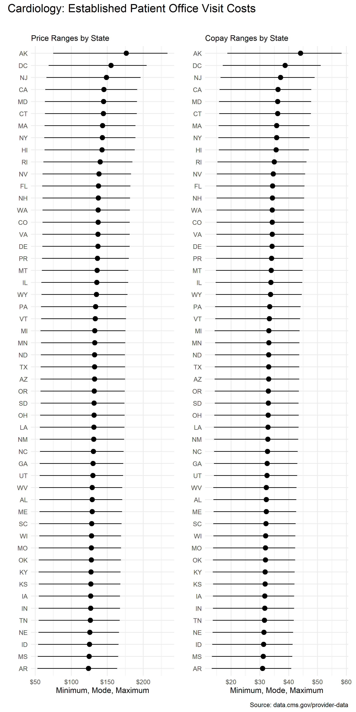
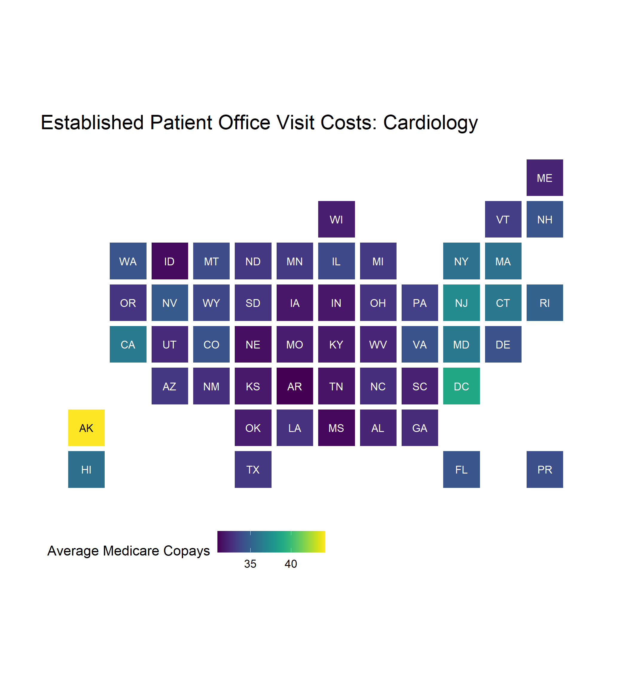

<!-- README.md is generated from README.Rmd. Please edit that file -->

# `costoffice` <a href="https://andrewallenbruce.github.io/costoffice/"></a>

<!-- badges: start -->

[](https://github.com/andrewallenbruce/costoffice/actions/workflows/R-CMD-check.yaml)
[](https://lifecycle.r-lib.org/articles/stages.html#experimental)
[](https://www.repostatus.org/#wip)
[](https://github.com/andrewallenbruce/costoffice)
[](https://github.com/andrewallenbruce/costoffice/commits/main)
[](https://www.codefactor.io/repository/github/andrewallenbruce/costoffice)
[](https://app.codecov.io/gh/andrewallenbruce/costoffice?branch=main)
<!-- badges: end -->

<br>

## Installation

You can install the development version of `costoffice` from
[GitHub](https://github.com/) with:

``` r
# install.packages("devtools")
devtools::install_github("andrewallenbruce/costoffice", dependencies = TRUE, build_vignettes = TRUE)
```

``` r
# install.packages("remotes")
remotes::install_github("andrewallenbruce/costoffice", dependencies = TRUE, build_vignettes = TRUE)
```

``` r
library(costoffice)
```

<br>

## Purpose

The `costoffice` package contains functions enabling the user to access
the latest **Physician Office Visit Costs** datasets from
[Data.CMS.gov](https://data.cms.gov/provider-data/search?page-size=50&theme=Physician%20office%20visit%20costs).

There are 83 datasets in total, the name corresponding to a medical
specialty(primary taxonomy). Each one contains:

- the most utilized procedure code (HCPCS Level II aka CPT code)
- the minimum, maximum, and mode price Medicare paid for the code and
- the minimum, maximum, and mode copay the patient paid for the visit

per zip code, for new and established patients both.

<br>

## `search_datasets()`

Call this function to return dataset information and the url to download
a csv file of the data.

<br>

Use the `specialty` argument to return only *exact* matches:

``` r
search_datasets(specialty = "cardiac surgery")
```

    #> # A tidytable: 1 × 6
    #>   specialty       title                 issued     modified   released   csv_url
    #>   <chr>           <chr>                 <date>     <date>     <date>     <chr>  
    #> 1 cardiac surgery Cardiac Surgery Offi… 2022-07-11 2022-07-11 2022-07-14 https:…

<br>

> Return a vector of the exact names of the medical specialties by
> simply calling `search_datasets()$specialty`.

<br>

Use the `keyword` argument to return *partial* matches:

``` r
search_datasets(keyword = "medicine")
```

    #> # A tidytable: 12 × 6
    #>    specialty                      title issued     modified   released   csv_url
    #>    <chr>                          <chr> <date>     <date>     <date>     <chr>  
    #>  1 addiction medicine             Addi… 2022-07-11 2022-07-11 2022-07-14 https:…
    #>  2 emergency medicine             Emer… 2022-07-11 2022-07-11 2022-07-14 https:…
    #>  3 geriatric medicine             Geri… 2022-07-11 2022-07-11 2022-07-14 https:…
    #>  4 internal medicine              Inte… 2022-07-11 2022-07-11 2022-07-14 https:…
    #>  5 nuclear medicine               Nucl… 2022-07-11 2022-07-11 2022-07-14 https:…
    #>  6 osteopathic manipulative medi… Oste… 2022-07-11 2022-07-11 2022-07-14 https:…
    #>  7 pediatric medicine             Pedi… 2022-07-11 2022-07-11 2022-07-14 https:…
    #>  8 physical medicine and rehabil… Phys… 2022-07-11 2022-07-11 2022-07-14 https:…
    #>  9 preventive medicine            Prev… 2022-07-11 2022-07-11 2022-07-14 https:…
    #> 10 sleep medicine                 Slee… 2022-07-11 2022-07-11 2022-07-14 https:…
    #> 11 sports medicine                Spor… 2022-07-11 2022-07-11 2022-07-14 https:…
    #> 12 undersea and hyperbaric medic… Unde… 2022-07-11 2022-07-11 2022-07-14 https:…

<br>

Calling the function with no arguments will return the entire dataset:

``` r
search_datasets()
```

    #> # A tidytable: 83 × 6
    #>    specialty                      title issued     modified   released   csv_url
    #>    <chr>                          <chr> <date>     <date>     <date>     <chr>  
    #>  1 addiction medicine             Addi… 2022-07-11 2022-07-11 2022-07-14 https:…
    #>  2 advanced heart failure and tr… Adva… 2022-07-11 2022-07-11 2022-07-14 https:…
    #>  3 allergy/ immunology            Alle… 2022-07-11 2022-07-11 2022-07-14 https:…
    #>  4 anesthesiology                 Anes… 2022-07-11 2022-07-11 2022-07-14 https:…
    #>  5 cardiac surgery                Card… 2022-07-11 2022-07-11 2022-07-14 https:…
    #>  6 cardiology                     Card… 2022-07-11 2022-07-11 2022-07-14 https:…
    #>  7 certified clinical nurse spec… Cert… 2022-07-11 2022-07-11 2022-07-14 https:…
    #>  8 certified nurse midwife        Cert… 2022-07-11 2022-07-11 2022-07-14 https:…
    #>  9 certified registered nurse an… Cert… 2022-07-11 2022-07-11 2022-07-14 https:…
    #> 10 clinic or group practice       Clin… 2022-07-11 2022-07-11 2022-07-14 https:…
    #> # ℹ 73 more rows

<br>

## `download_dataset()`

Once you’ve found the dataset that you’re interested in, simply insert
the `download_dataset()` function into your pipeline to retrieve the
csv:

``` r
search_datasets(specialty = "vascular surgery") |> 
  download_dataset() |> 
  head(n = 10)
```

    #> # A tidytable: 10 × 9
    #>    specialty        zip_code hcpcs patient cost    min   max  mode range
    #>    <chr>            <chr>    <chr> <chr>   <chr> <dbl> <dbl> <dbl> <dbl>
    #>  1 vascular surgery 00210    99203 new     copay  15.0  45.4  23.1  30.4
    #>  2 vascular surgery 00210    99203 new     price  60.1 182.   92.3 121. 
    #>  3 vascular surgery 00211    99203 new     copay  15.0  45.4  23.1  30.4
    #>  4 vascular surgery 00211    99203 new     price  60.1 182.   92.3 121. 
    #>  5 vascular surgery 00212    99203 new     copay  15.0  45.4  23.1  30.4
    #>  6 vascular surgery 00212    99203 new     price  60.1 182.   92.3 121. 
    #>  7 vascular surgery 00213    99203 new     copay  15.0  45.4  23.1  30.4
    #>  8 vascular surgery 00213    99203 new     price  60.1 182.   92.3 121. 
    #>  9 vascular surgery 00214    99203 new     copay  15.0  45.4  23.1  30.4
    #> 10 vascular surgery 00214    99203 new     price  60.1 182.   92.3 121.

<br>

## `use_zipcoder()`

``` r
search_datasets(specialty = "vascular surgery") |> 
  download_dataset() |> 
  tidytable::slice_sample(n = 10) |> 
  use_zipcoder()
```

    #> # A tidytable: 10 × 14
    #>    specialty   city  county state zip_code hcpcs patient cost    min   max  mode
    #>    <chr>       <chr> <chr>  <chr> <chr>    <chr> <chr>   <chr> <dbl> <dbl> <dbl>
    #>  1 vascular s… Brad… Manat… FL    34282    99203 new     price 58.4  179.   90.2
    #>  2 vascular s… Lewi… Dento… TX    75067    99213 est     price 17.7  141.   71.2
    #>  3 vascular s… Cent… Knox … NE    68724    99213 est     price 17    136.   68.6
    #>  4 vascular s… Quit… Brisc… TX    79255    99203 new     copay 14.2   43.2  21.8
    #>  5 vascular s… Bost… Morga… GA    30623    99203 new     price 55.2  170.   85.5
    #>  6 vascular s… Byro… Dooly… GA    31007    99203 new     copay 13.8   42.4  21.4
    #>  7 vascular s… Keni… Cook … IL    60043    99213 est     copay  4.82  38.8  19.6
    #>  8 vascular s… Park… Summi… UT    84068    99203 new     price 56.2  172.   86.7
    #>  9 vascular s… Herm… Custe… SD    57744    99203 new     copay 14.4   43.5  22.1
    #> 10 vascular s… Rent… King … WA    98056    99203 new     price 65.5  195.   99.8
    #> # ℹ 3 more variables: range <dbl>, state_name <chr>, state_region <fct>

<br>

## `download_datasets()`

``` r
download_datasets(keyword = "medicine")
```

    #> # A tidytable: 2,009,808 × 14
    #>    specialty   city  county state zip_code hcpcs patient cost    min   max  mode
    #>    <chr>       <chr> <chr>  <chr> <chr>    <chr> <chr>   <chr> <dbl> <dbl> <dbl>
    #>  1 Addiction_… Holt… Suffo… NY    00501    99204 new     copay  17.9  53.8  40.7
    #>  2 Addiction_… Holt… Suffo… NY    00501    99204 new     price  71.5 215.  163. 
    #>  3 Addiction_… Holt… Suffo… NY    00544    99204 new     copay  17.9  53.8  40.7
    #>  4 Addiction_… Holt… Suffo… NY    00544    99204 new     price  71.5 215.  163. 
    #>  5 Addiction_… Adju… Adjun… PR    00601    99204 new     copay  14.8  45.0  34.1
    #>  6 Addiction_… Adju… Adjun… PR    00601    99204 new     price  59.4 180.  136. 
    #>  7 Addiction_… Agua… Aguad… PR    00602    99204 new     copay  14.8  45.0  34.1
    #>  8 Addiction_… Agua… Aguad… PR    00602    99204 new     price  59.4 180.  136. 
    #>  9 Addiction_… Agua… Aguad… PR    00603    99204 new     copay  14.8  45.0  34.1
    #> 10 Addiction_… Agua… Aguad… PR    00603    99204 new     price  59.4 180.  136. 
    #> # ℹ 2,009,798 more rows
    #> # ℹ 3 more variables: range <dbl>, state_name <chr>, state_region <fct>

<br>

## Summary Statistics by State

Current average prices by state for a **New Patient** office visit to a
**Vascular Surgeon**:

``` r
download_datasets(specialty = "vascular surgery") |> 
  tidytable::filter(patient == "new") |> 
  tidytable::summarise(n = tidytable::n.(),
    avg_min = round(mean(min), 2),
                       avg_max = round(mean(max), 2),
                       avg_mode = round(mean(mode), 2),
                       avg_range = round(mean(range), 2),
                       .by = c(specialty, 
                               state, 
                               hcpcs, 
                               cost)) |> 
  tidytable::arrange(cost)
```

    #> # A tidytable: 104 × 9
    #>    specialty        state hcpcs cost      n avg_min avg_max avg_mode avg_range
    #>    <chr>            <chr> <chr> <chr> <int>   <dbl>   <dbl>    <dbl>     <dbl>
    #>  1 Vascular_Surgery AK    99203 copay   274    18.7    58.4     29.2      39.7
    #>  2 Vascular_Surgery AL    99203 copay   839    13.9    42.6     21.5      28.8
    #>  3 Vascular_Surgery AR    99203 copay   710    13.3    40.9     20.6      27.6
    #>  4 Vascular_Surgery AZ    99203 copay   568    14.3    43.7     22.1      29.3
    #>  5 Vascular_Surgery CA    99203 copay  2654    16.0    47.9     24.4      31.9
    #>  6 Vascular_Surgery CO    99203 copay   661    15.0    45.2     23.0      30.2
    #>  7 Vascular_Surgery CT    99203 copay   438    15.9    47.7     24.3      31.8
    #>  8 Vascular_Surgery DC    99203 copay   296    17.1    51.1     26.2      34  
    #>  9 Vascular_Surgery DE    99203 copay    98    15.0    45.2     23.0      30.3
    #> 10 Vascular_Surgery FL    99203 copay  1495    14.9    45.5     23.0      30.6
    #> # ℹ 94 more rows

<br>

Current average prices by state for an **Established Patient** office
visit to a **Cardiologist**:

``` r
est_cardio <- download_datasets(specialty = "cardiology") |> 
  tidytable::filter(patient == "new") |> 
  tidytable::summarise(n = tidytable::n.(),
    avg_min = round(mean(min), 2),
                       avg_max = round(mean(max), 2),
                       avg_mode = round(mean(mode), 2),
                       avg_range = round(mean(range), 2),
                       .by = c(specialty, 
                               state, 
                               hcpcs, 
                               cost)) |> 
  tidytable::arrange(cost)

est_cardio
```

    #> # A tidytable: 104 × 9
    #>    specialty  state hcpcs cost      n avg_min avg_max avg_mode avg_range
    #>    <chr>      <chr> <chr> <chr> <int>   <dbl>   <dbl>    <dbl>     <dbl>
    #>  1 Cardiology AK    99204 copay   274    18.7    58.4     44.1      39.7
    #>  2 Cardiology AL    99204 copay   839    13.9    42.6     32.3      28.8
    #>  3 Cardiology AR    99204 copay   710    13.3    40.9     31.0      27.6
    #>  4 Cardiology AZ    99204 copay   568    14.3    43.7     33.1      29.3
    #>  5 Cardiology CA    99204 copay  2654    16.0    47.9     36.3      31.9
    #>  6 Cardiology CO    99204 copay   661    15.0    45.2     34.3      30.2
    #>  7 Cardiology CT    99204 copay   438    15.9    47.7     36.2      31.8
    #>  8 Cardiology DC    99204 copay   296    17.1    51.1     38.8      34  
    #>  9 Cardiology DE    99204 copay    98    15.0    45.2     34.3      30.3
    #> 10 Cardiology FL    99204 copay  1495    14.9    45.5     34.4      30.6
    #> # ℹ 94 more rows

<br>

## Visualizations

``` r
p1 <- ggplot2::ggplot(est_cardio |> tidytable::filter(cost == "price"), 
      ggplot2::aes(forcats::fct_reorder(state, avg_mode, median), avg_mode)) + 
  ggplot2::geom_pointrange(ggplot2::aes(ymin = avg_min, ymax = avg_max), 
    size = 0, colour = "black", linewidth = 0.5) +
  ggplot2::geom_point(color = "black", size = 3) +
  ggplot2::coord_flip() +
  ggplot2::scale_y_continuous(labels = scales::label_dollar()) +
  ggplot2::labs(
    x = "", 
    y = "Minimum, Mode, Maximum",
    title = "",
    subtitle = "Price Ranges by State") +
  ggplot2::theme_minimal()

p2 <- ggplot2::ggplot(est_cardio |> tidytable::filter(cost == "copay"), 
      ggplot2::aes(forcats::fct_reorder(state, avg_mode, median), avg_mode)) + 
  ggplot2::geom_pointrange(ggplot2::aes(ymin = avg_min, ymax = avg_max), 
    size = 0, colour = "black", linewidth = 0.5) +
  ggplot2::geom_point(color = "black", size = 3) +
  ggplot2::coord_flip() +
  ggplot2::scale_y_continuous(labels = scales::label_dollar()) +
  ggplot2::labs(
    x = "", 
    y = "Minimum, Mode, Maximum",
    title = "",
    subtitle = "Copay Ranges by State") +
  ggplot2::theme_minimal()

library(patchwork)
(p1 + p2) +
  plot_annotation(
    title = "Cardiology: Established Patient Office Visit Costs",
    caption = "Source: data.cms.gov/provider-data",
    theme = ggplot2::theme(plot.title = ggplot2::element_text(size = 16))
  )
```



<br>

``` r
library(statebins)

statebins(est_cardio |> tidytable::filter(cost == "copay"), 
          value_col = "avg_mode",
          name = "Average Medicare Copays",
          ggplot2_scale_function = viridis::scale_fill_viridis,
          direction = 1,
          round = FALSE) +
  ggplot2::labs(title = "Established Patient Office Visit Costs: Cardiology") +
  theme_statebins()
```



<br>

## Code of Conduct

Please note that the `costoffice` project is released with a
[Contributor Code of
Conduct](https://andrewallenbruce.github.io/costoffice/CODE_OF_CONDUCT.html).
By contributing to this project, you agree to abide by its terms.
