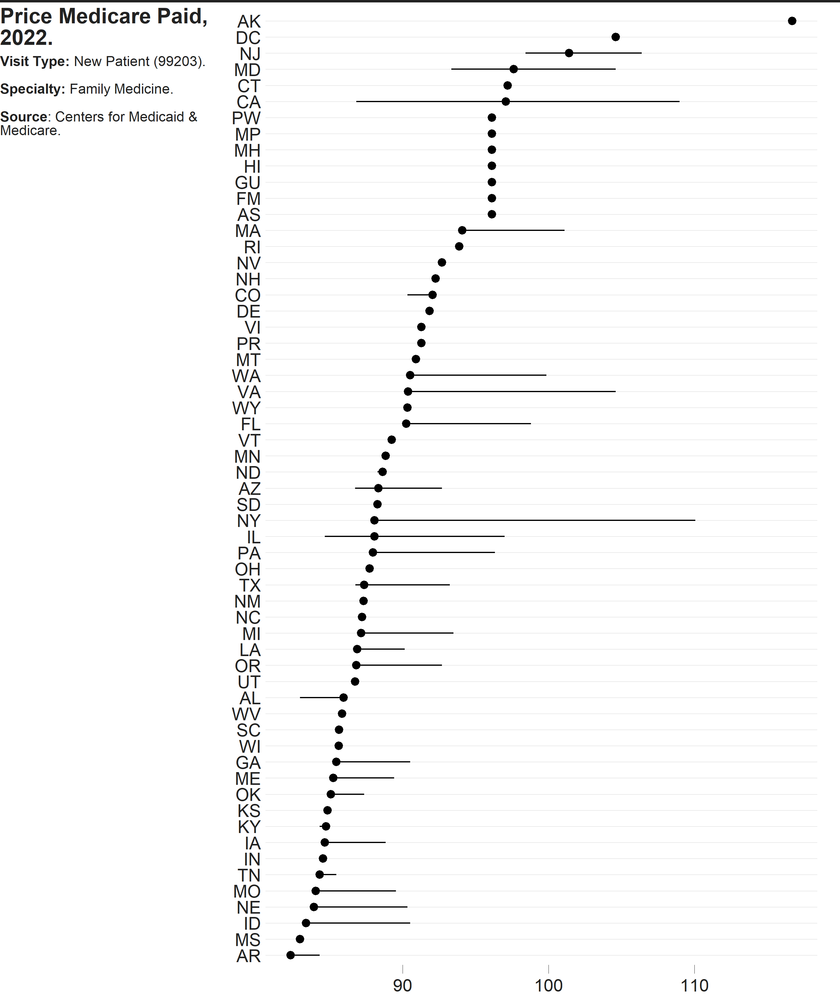
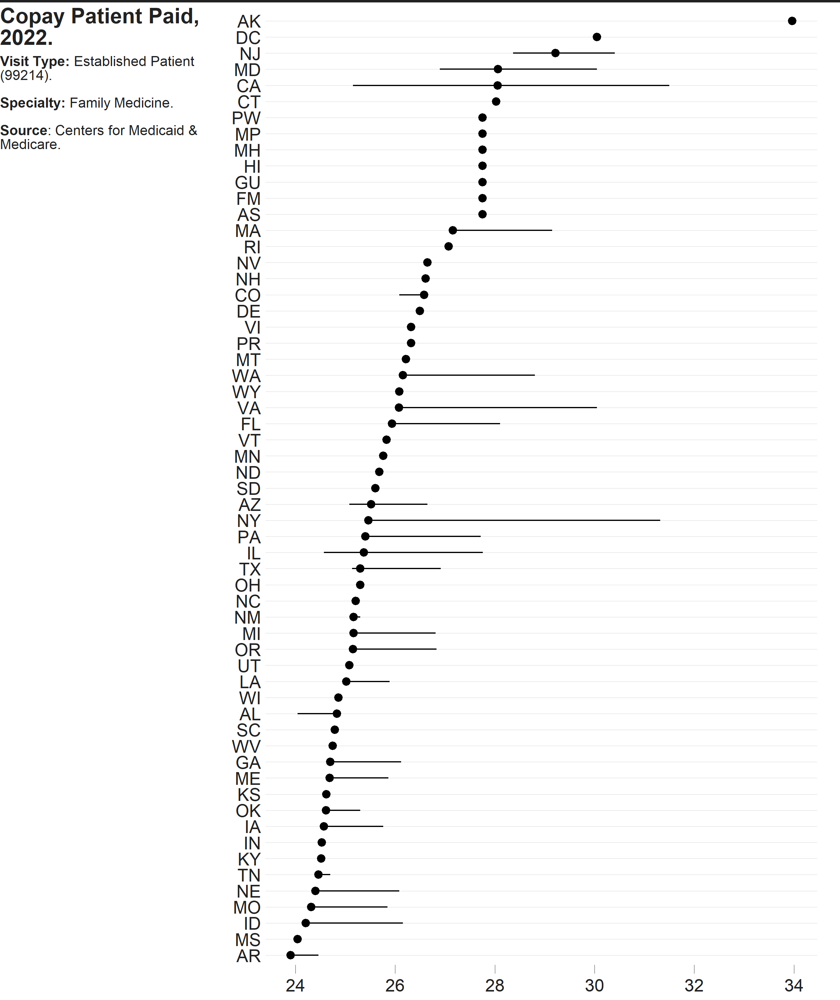

<!-- README.md is generated from README.Rmd. Please edit that file -->

# `{costoffice}`

The `costoffice` package contains functions enabling the user to access
the latest **Physician Office Visit Costs** datasets from
[Data.CMS.gov](https://data.cms.gov/provider-data/search?page-size=50&theme=Physician%20office%20visit%20costs).

There are 83 datasets in total, each representing a different medical
specialty.

Broken down by ZIP code, they contain the:

- **Most Utilized HCPCS** Level II Procedure Code (for both *New* and
  *Established* patients)
- **Price Medicare Paid** for the Visit (Min-Mode-Max)
- **Copay the Patient Paid** for the Visit (Min-Mode-Max)

<!-- badges: start -->

[](https://github.com/andrewallenbruce/costoffice/actions/workflows/R-CMD-check.yaml)
[](https://lifecycle.r-lib.org/articles/stages.html#experimental)
[](https://www.repostatus.org/#wip)
[](https://github.com/andrewallenbruce/costoffice)
[](https://github.com/andrewallenbruce/costoffice/commits/main)
[](https://www.codefactor.io/repository/github/andrewallenbruce/costoffice)
[](https://app.codecov.io/gh/andrewallenbruce/costoffice?branch=main)
<!-- badges: end -->

## Installation

You can install the development version of `costoffice` from
[GitHub](https://github.com/) with:

``` r
# install.packages("devtools")
devtools::install_github("andrewallenbruce/costoffice", build_vignettes = TRUE)
```

``` r
# install.packages("remotes")
remotes::install_github("andrewallenbruce/costoffice", build_vignettes = TRUE)
```

``` r
library(costoffice)
```

## `search_datasets()`

Returns a data frame of each dataset’s medical specialty, date of most
recent release, and a download link for it’s corresponding csv file:

``` r
# Call with no arguments to return the entire data frame
search_datasets()
```

    #> # A tibble: 83 × 3
    #>    specialty                                        released   csv_url          
    #>    <chr>                                            <date>     <chr>            
    #>  1 addiction_medicine                               2022-07-14 https://data.cms…
    #>  2 advanced_heart_failure_and_transplant_cardiology 2022-07-14 https://data.cms…
    #>  3 allergy_immunology                               2022-07-14 https://data.cms…
    #>  4 anesthesiology                                   2022-07-14 https://data.cms…
    #>  5 cardiac_surgery                                  2022-07-14 https://data.cms…
    #>  6 cardiology                                       2022-07-14 https://data.cms…
    #>  7 certified_clinical_nurse_specialist              2022-07-14 https://data.cms…
    #>  8 certified_nurse_midwife                          2022-07-14 https://data.cms…
    #>  9 certified_registered_nurse_anesthetist_crna      2022-07-14 https://data.cms…
    #> 10 clinic_or_group_practice                         2022-07-14 https://data.cms…
    #> # ℹ 73 more rows

<br>

If needed, there are two arguments to this function. Use the `specialty`
argument to return only *exact* matches (note the underscore in the
names):

``` r
search_datasets(specialty = "emergency_medicine")
```

    #> # A tibble: 1 × 3
    #>   specialty          released   csv_url                                         
    #>   <chr>              <date>     <chr>                                           
    #> 1 emergency_medicine 2022-07-14 https://data.cms.gov/provider-data/sites/defaul…

<br>

Use the `keyword` argument to return *partial* matches:

``` r
search_datasets(keyword = "medicine")
```

    #> # A tibble: 12 × 3
    #>    specialty                            released   csv_url                      
    #>    <chr>                                <date>     <chr>                        
    #>  1 addiction_medicine                   2022-07-14 https://data.cms.gov/provide…
    #>  2 emergency_medicine                   2022-07-14 https://data.cms.gov/provide…
    #>  3 geriatric_medicine                   2022-07-14 https://data.cms.gov/provide…
    #>  4 internal_medicine                    2022-07-14 https://data.cms.gov/provide…
    #>  5 nuclear_medicine                     2022-07-14 https://data.cms.gov/provide…
    #>  6 osteopathic_manipulative_medicine    2022-07-14 https://data.cms.gov/provide…
    #>  7 pediatric_medicine                   2022-07-14 https://data.cms.gov/provide…
    #>  8 physical_medicine_and_rehabilitation 2022-07-14 https://data.cms.gov/provide…
    #>  9 preventive_medicine                  2022-07-14 https://data.cms.gov/provide…
    #> 10 sleep_medicine                       2022-07-14 https://data.cms.gov/provide…
    #> 11 sports_medicine                      2022-07-14 https://data.cms.gov/provide…
    #> 12 undersea_and_hyperbaric_medicine     2022-07-14 https://data.cms.gov/provide…

<br>

> Return a vector of the exact names of the medical specialties by
> simply calling `search_datasets()$specialty`:

<br>

<details closed>
<summary>
<span title="Click to Expand"> Available Medical Specialties </span>
</summary>

``` r

addiction_medicine
advanced_heart_failure_and_transplant_cardiology
allergy_immunology
anesthesiology
cardiac_surgery
cardiology
certified_clinical_nurse_specialist
certified_nurse_midwife
certified_registered_nurse_anesthetist_crna
clinic_or_group_practice
clinical_cardiac_electrophysiology
clinical_laboratory
colorectal_surgery_proctology
critical_care_intensivists
dentist
dermatology
diagnostic_radiology
emergency_medicine
endocrinology
family_practice
gastroenterology
general_practice
general_surgery
geriatric_medicine
geriatric_psychiatry
gynecological_oncology
hand_surgery
hematology
hematology_oncology
hematopoietic_cell_transplantation_and_cellular_therapy
hospice_and_palliative_care
hospitalist
infectious_disease
internal_medicine
interventional_cardiology
interventional_pain_management
interventional_radiology
licensed_clinical_social_worker
mammography_center
maxillofacial_surgery
medical_genetics_and_genomics
medical_oncology
medical_toxicology
nephrology
neurology
neuropsychiatry
neurosurgery
nuclear_medicine
nurse_practitioner
obstetrics_gynecology
ophthalmology
optometry
oral_surgery_dentist_only
orthopedic_surgery
osteopathic_manipulative_medicine
otolaryngology
pain_management
pathology
pediatric_medicine
peripheral_vascular_disease
physical_medicine_and_rehabilitation
physical_therapist_in_private_practice
physician_assistant
plastic_and_reconstructive_surgery
podiatry
preventive_medicine
psychiatry
psychologist_clinical
public_health_or_welfare_agency
pulmonary_disease
radiation_oncology
registered_dietitian_or_nutrition_professional
rheumatology
sleep_medicine
speech_language_pathologist
sports_medicine
surgical_oncology
thoracic_surgery
undefined_physician_type
undersea_and_hyperbaric_medicine
unknown_supplierprovider_specialty
urology
vascular_surgery
```

</details>

<br>

## Example: Overview

``` r
dir <- "E:/costoffice_data/costoffice_2022_raw_data/"
paths <- list.files(dir, pattern = "[.]csv$", full.names = TRUE)
names <- basename(paths)
out <- gsub(".csv", ".rds", names)
outdir <- "E:/costoffice_data/costoffice_2022_clean_data/"

df_specialty <- out |>
  purrr::map(\(x) costoffice:::summarise_by_specialty(dir = outdir, name = x)) |>
  purrr::list_rbind()

df_state <- out |>
  purrr::map(\(x) costoffice:::summarise_by_state(dir = outdir, name = x)) |>
  purrr::list_rbind()

df_spec_state <- out |>
  purrr::map(\(x) costoffice:::summarise_by_spec_state(dir = outdir, name = x)) |>
  purrr::list_rbind()
```

<br>

### Summary by **Specialty**

``` r
df_specialty
```

    #> # A tibble: 332 × 9
    #>    specialty          type      n   min avg_min avg_mode avg_max   max avg_range
    #>    <chr>              <chr> <int> <dbl>   <dbl>    <dbl>   <dbl> <dbl>     <dbl>
    #>  1 Addiction Medicine Esta… 43530  4.06    4.06     25.9    4.06  47.7      31.7
    #>  2 Addiction Medicine Esta… 43530 16.3    16.3     104.    16.3  191.      127. 
    #>  3 Addiction Medicine New … 43530 13.3    13.3      33.6   13.3   58.4      29.8
    #>  4 Addiction Medicine New … 43530 53.1    53.1     134.    53.1  234.      119. 
    #>  5 Advanced Heart Fa… Esta… 43530  4.06    4.06     25.9    4.06  47.7      31.7
    #>  6 Advanced Heart Fa… Esta… 43530 16.3    16.3     104.    16.3  191.      127. 
    #>  7 Advanced Heart Fa… New … 43530 13.3    13.3      33.6   13.3   58.4      29.8
    #>  8 Advanced Heart Fa… New … 43530 53.1    53.1     134.    53.1  234.      119. 
    #>  9 Allergy Immunology Esta… 43530  4.06    4.06     18.2    4.06  47.7      31.7
    #> 10 Allergy Immunology Esta… 43530 16.3    16.3      73.0   16.3  191.      127. 
    #> # ℹ 322 more rows

``` r
table(df_specialty$specialty, df_specialty$type) |> 
  as.data.frame() |> 
  dplyr::tibble() |> 
  dplyr::select(specialty = Var1, 
                type = Var2, 
                count = Freq) |> 
  dplyr::group_by(type) |> 
  dplyr::summarise(count = sum(count)) |> 
  dplyr::arrange(dplyr::desc(count))
```

    #> # A tibble: 16 × 2
    #>    type                      count
    #>    <fct>                     <int>
    #>  1 Established Copay (99214)    41
    #>  2 Established Price (99214)    41
    #>  3 Established Copay (99213)    39
    #>  4 Established Price (99213)    39
    #>  5 New Copay (99204)            32
    #>  6 New Price (99204)            32
    #>  7 New Copay (99203)            29
    #>  8 New Price (99203)            29
    #>  9 New Copay (99205)            18
    #> 10 New Price (99205)            18
    #> 11 New Copay (NA)                4
    #> 12 New Price (NA)                4
    #> 13 Established Copay (99211)     2
    #> 14 Established Price (99211)     2
    #> 15 Established Copay (99215)     1
    #> 16 Established Price (99215)     1

<br>

### Summary by **State**

``` r
df_state
```

    #> # A tibble: 19,920 × 9
    #>    state type                   n   min avg_min avg_mode avg_max   max avg_range
    #>    <chr> <chr>              <int> <dbl>   <dbl>    <dbl>   <dbl> <dbl>     <dbl>
    #>  1 AK    Established Copay…   282  5.59    5.59     34.0    5.59  47.7      42.1
    #>  2 AK    Established Price…   282 22.4    22.4     136.    22.4  191.      168. 
    #>  3 AK    New Copay (99204)    282 18.7    18.7      44.1   18.7   58.4      39.7
    #>  4 AK    New Price (99204)    282 74.8    74.8     176.    74.8  234.      159. 
    #>  5 AL    Established Copay…   859  4.06    4.06     24.8    4.06  34.8      30.5
    #>  6 AL    Established Price…   859 16.3    16.3      99.3   16.3  139.      122. 
    #>  7 AL    New Copay (99204)    859 13.4    13.4      32.3   13.4   42.7      28.8
    #>  8 AL    New Price (99204)    859 53.5    53.5     129.    53.5  171.      115. 
    #>  9 AR    Established Copay…   738  4.07    4.07     23.9    4.07  34.2      29.4
    #> 10 AR    Established Price…   738 16.3    16.3      95.6   16.3  137.      118. 
    #> # ℹ 19,910 more rows

<br>

``` r
table(df_state$state, df_state$type) |> 
  as.data.frame() |> 
  dplyr::tibble() |> 
  dplyr::select(state = Var1, 
                type = Var2, 
                count = Freq) |> 
  dplyr::group_by(type) |> 
  dplyr::summarise(count = sum(count)) |> 
  dplyr::arrange(dplyr::desc(count))
```

    #> # A tibble: 16 × 2
    #>    type                      count
    #>    <fct>                     <int>
    #>  1 Established Copay (99214)  2419
    #>  2 Established Price (99214)  2419
    #>  3 Established Copay (99213)  2301
    #>  4 Established Price (99213)  2301
    #>  5 New Copay (99204)          1888
    #>  6 New Price (99204)          1888
    #>  7 New Copay (99203)          1711
    #>  8 New Price (99203)          1711
    #>  9 New Copay (99205)          1062
    #> 10 New Price (99205)          1062
    #> 11 New Copay (NA)              236
    #> 12 New Price (NA)              236
    #> 13 Established Copay (99211)   118
    #> 14 Established Price (99211)   118
    #> 15 Established Copay (99215)    59
    #> 16 Established Price (99215)    59

<br>

### Summary by **Specialty & State**

``` r
df_spec_state
```

    #> # A tibble: 19,920 × 10
    #>    specialty          state type  zip_codes   min avg_min avg_mode avg_max   max
    #>    <chr>              <chr> <chr>     <int> <dbl>   <dbl>    <dbl>   <dbl> <dbl>
    #>  1 Addiction Medicine AK    Esta…       282  5.59    5.59     34.0    5.59  47.7
    #>  2 Addiction Medicine AK    Esta…       282 22.4    22.4     136.    22.4  191. 
    #>  3 Addiction Medicine AK    New …       282 18.7    18.7      44.1   18.7   58.4
    #>  4 Addiction Medicine AK    New …       282 74.8    74.8     176.    74.8  234. 
    #>  5 Addiction Medicine AL    Esta…       859  4.06    4.06     24.8    4.06  34.8
    #>  6 Addiction Medicine AL    Esta…       859 16.3    16.3      99.3   16.3  139. 
    #>  7 Addiction Medicine AL    New …       859 13.4    13.4      32.3   13.4   42.7
    #>  8 Addiction Medicine AL    New …       859 53.5    53.5     129.    53.5  171. 
    #>  9 Addiction Medicine AR    Esta…       738  4.07    4.07     23.9    4.07  34.2
    #> 10 Addiction Medicine AR    Esta…       738 16.3    16.3      95.6   16.3  137. 
    #> # ℹ 19,910 more rows
    #> # ℹ 1 more variable: avg_range <dbl>

<br>

## Example: `Family Practice` Specialty

``` r
fam_pract <- search_datasets(specialty = "family_practice") |> 
  dplyr::pull(csv_url) |> 
  costoffice:::tidyup(name = "Family Practice")
```

``` r
# Mode Variation by Region
fam_pract |> 
  dplyr::mutate(hcpcs = paste0("(", hcpcs, ")")) |> 
  tidyr::unite("type", c(patient, cost, hcpcs), sep = " ") |> 
  dplyr::group_by(region, type) |> 
  skimr::skim(dplyr::where(is.numeric)) |> 
  skimr::yank("numeric") |> 
  dplyr::filter(skim_variable == "mode") |> 
  dplyr::select(!c(n_missing, complete_rate, skim_variable)) |>
  dplyr::arrange(type) |> 
  head(20)
```

**Variable type: numeric**

| region    | type                      |   mean |   sd |    p0 |    p25 |    p50 |    p75 |   p100 | hist  |
|:----------|:--------------------------|-------:|-----:|------:|-------:|-------:|-------:|-------:|:------|
| Northeast | Established Copay (99214) |  26.94 | 1.87 | 24.69 |  25.41 |  25.83 |  28.37 |  31.32 | ▇▂▃▂▂ |
| Midwest   | Established Copay (99214) |  25.15 | 0.72 | 24.32 |  24.57 |  25.16 |  25.37 |  27.76 | ▇▆▂▁▁ |
| South     | Established Copay (99214) |  25.42 | 1.25 | 23.90 |  24.70 |  25.21 |  25.94 |  30.05 | ▇▆▁▁▁ |
| West      | Established Copay (99214) |  27.04 | 2.04 | 24.21 |  25.52 |  26.58 |  28.05 |  33.96 | ▇▇▂▁▁ |
| NA        | Established Copay (99214) |  26.40 | 1.14 | 23.90 |  26.32 |  26.32 |  26.32 |  31.32 | ▂▇▂▁▁ |
| Northeast | Established Price (99214) | 107.76 | 7.49 | 98.76 | 101.62 | 103.32 | 113.47 | 125.27 | ▇▂▃▂▂ |
| Midwest   | Established Price (99214) | 100.61 | 2.88 | 97.26 |  98.30 | 100.66 | 101.50 | 111.04 | ▇▆▂▁▁ |
| South     | Established Price (99214) | 101.68 | 5.01 | 95.61 |  98.79 | 100.83 | 103.76 | 120.20 | ▇▆▁▁▁ |
| West      | Established Price (99214) | 108.16 | 8.17 | 96.84 | 102.07 | 106.33 | 112.22 | 135.85 | ▇▇▂▁▁ |
| NA        | Established Price (99214) | 105.59 | 4.57 | 95.61 | 105.28 | 105.28 | 105.28 | 125.27 | ▂▇▂▁▁ |
| Northeast | New Copay (99203)         |  23.37 | 1.72 | 21.31 |  21.99 |  22.31 |  24.61 |  27.52 | ▇▂▃▂▂ |
| Midwest   | New Copay (99203)         |  21.73 | 0.68 | 20.98 |  21.17 |  21.79 |  22.01 |  24.25 | ▇▇▁▁▁ |
| South     | New Copay (99203)         |  22.00 | 1.14 | 20.58 |  21.36 |  21.80 |  22.56 |  26.15 | ▇▇▁▁▁ |
| West      | New Copay (99203)         |  23.39 | 1.75 | 20.84 |  22.08 |  23.01 |  24.26 |  29.17 | ▅▇▃▁▁ |
| NA        | New Copay (99203)         |  22.88 | 1.03 | 20.58 |  22.82 |  22.82 |  22.82 |  27.52 | ▂▇▂▁▁ |
| Northeast | New Price (99203)         |  93.47 | 6.89 | 85.25 |  87.96 |  89.24 |  98.42 | 110.06 | ▇▂▃▂▂ |
| Midwest   | New Price (99203)         |  86.94 | 2.74 | 83.92 |  84.67 |  87.16 |  88.06 |  96.99 | ▇▇▁▁▁ |
| South     | New Price (99203)         |  88.01 | 4.57 | 82.31 |  85.46 |  87.21 |  90.25 | 104.59 | ▇▇▁▁▁ |
| West      | New Price (99203)         |  93.56 | 6.99 | 83.37 |  88.34 |  92.05 |  97.05 | 116.69 | ▅▇▃▁▁ |
| NA        | New Price (99203)         |  91.51 | 4.10 | 82.31 |  91.28 |  91.28 |  91.28 | 110.06 | ▂▇▂▁▁ |

<br>

``` r
# Established Patient Price (99214)
fam_pract |> 
  dplyr::filter(cost == "Price") |> 
  dplyr::mutate(hcpcs = paste0("(", hcpcs, ")")) |> 
  tidyr::unite("type", c(patient, cost, hcpcs), sep = " ") |> 
  dplyr::group_by(type) |> 
  skimr::skim(dplyr::where(is.numeric)) |> 
  skimr::yank("numeric") |> 
  dplyr::filter(type == "Established Price (99214)") |> 
  dplyr::select(!c(n_missing, complete_rate, type))
```

**Variable type: numeric**

| skim_variable |   mean |   sd |     p0 |    p25 |    p50 |    p75 |   p100 | hist  |
|:--------------|-------:|-----:|-------:|-------:|-------:|-------:|-------:|:------|
| min           |  18.07 | 1.46 |  16.26 |  17.04 |  17.62 |  18.54 |  23.77 | ▇▃▂▁▁ |
| max           | 144.80 | 9.07 | 133.85 | 138.80 | 142.08 | 147.31 | 190.74 | ▇▃▁▁▁ |
| mode          | 103.65 | 6.63 |  95.61 |  98.99 | 101.50 | 105.65 | 135.85 | ▇▃▁▁▁ |
| range         | 126.72 | 7.68 | 117.58 | 121.56 | 124.49 | 128.95 | 168.37 | ▇▂▁▁▁ |

<br>

``` r
# New Patient Price (99203)
fam_pract |> 
  dplyr::filter(cost == "Price") |> 
  dplyr::mutate(hcpcs = paste0("(", hcpcs, ")")) |> 
  tidyr::unite("type", c(patient, cost, hcpcs), sep = " ") |> 
  dplyr::group_by(type) |> 
  skimr::skim(dplyr::where(is.numeric)) |> 
  skimr::yank("numeric") |> 
  dplyr::filter(type == "New Price (99203)") |> 
  dplyr::select(!c(n_missing, complete_rate, type))
```

**Variable type: numeric**

| skim_variable |   mean |    sd |     p0 |    p25 |    p50 |    p75 |   p100 | hist  |
|:--------------|-------:|------:|-------:|-------:|-------:|-------:|-------:|:------|
| min           |  58.24 |  4.04 |  53.14 |  55.31 |  56.94 |  59.43 |  74.82 | ▇▃▁▁▁ |
| max           | 177.24 | 11.13 | 163.67 | 169.74 | 174.06 | 180.62 | 233.63 | ▇▃▁▁▁ |
| mode          |  89.70 |  5.93 |  82.31 |  85.61 |  87.96 |  91.33 | 116.69 | ▇▃▁▁▁ |
| range         | 119.00 |  7.12 | 110.54 | 114.54 | 116.89 | 120.94 | 158.82 | ▇▂▁▁▁ |

<br>

``` r
# Established Patient Copay (99214)
fam_pract |> 
  dplyr::filter(cost == "Copay") |> 
  dplyr::mutate(hcpcs = paste0("(", hcpcs, ")")) |> 
  tidyr::unite("type", c(patient, cost, hcpcs), sep = " ") |> 
  dplyr::group_by(type) |> 
  skimr::skim(dplyr::where(is.numeric)) |> 
  skimr::yank("numeric") |> 
  dplyr::filter(type == "Established Copay (99214)") |> 
  dplyr::select(!c(n_missing, complete_rate, type))
```

**Variable type: numeric**

| skim_variable |  mean |   sd |    p0 |   p25 |   p50 |   p75 |  p100 | hist  |
|:--------------|------:|-----:|------:|------:|------:|------:|------:|:------|
| min           |  4.52 | 0.36 |  4.06 |  4.26 |  4.40 |  4.64 |  5.94 | ▇▃▂▁▁ |
| max           | 36.20 | 2.27 | 33.46 | 34.70 | 35.52 | 36.83 | 47.69 | ▇▃▁▁▁ |
| mode          | 25.91 | 1.66 | 23.90 | 24.75 | 25.37 | 26.41 | 33.96 | ▇▃▁▁▁ |
| range         | 31.68 | 1.92 | 29.40 | 30.39 | 31.12 | 32.24 | 42.09 | ▇▂▁▁▁ |

<br>

``` r
# New Patient Copay (99203)
fam_pract |> 
  dplyr::filter(cost == "Copay") |> 
  dplyr::mutate(hcpcs = paste0("(", hcpcs, ")")) |> 
  tidyr::unite("type", c(patient, cost, hcpcs), sep = " ") |> 
  dplyr::group_by(type) |> 
  skimr::skim(dplyr::where(is.numeric)) |> 
  skimr::yank("numeric") |> 
  dplyr::filter(type == "New Copay (99203)") |> 
  dplyr::select(!c(n_missing, complete_rate, type))
```

**Variable type: numeric**

| skim_variable |  mean |   sd |    p0 |   p25 |   p50 |   p75 |  p100 | hist  |
|:--------------|------:|-----:|------:|------:|------:|------:|------:|:------|
| min           | 14.56 | 1.01 | 13.28 | 13.83 | 14.23 | 14.86 | 18.70 | ▇▃▁▁▁ |
| max           | 44.31 | 2.78 | 40.92 | 42.43 | 43.51 | 45.16 | 58.41 | ▇▃▁▁▁ |
| mode          | 22.42 | 1.48 | 20.58 | 21.40 | 21.99 | 22.83 | 29.17 | ▇▃▁▁▁ |
| range         | 29.75 | 1.78 | 27.63 | 28.64 | 29.22 | 30.24 | 39.70 | ▇▂▁▁▁ |

<br>

<details>
<summary>
Code
</summary>

``` r
library(ggplot2)
library(cmapplot)
p <- fam_pract |> 
  dplyr::filter(cost == "Price") |> 
  dplyr::mutate(hcpcs = paste0("(", hcpcs, ")")) |> 
  tidyr::unite("type", c(patient, cost, hcpcs), sep = " ") |> 
  ggplot(aes(x = mode, 
             color = type, 
             fill = type)) + 
  cmapplot::theme_cmap(
    gridlines = "h", 
    axisticks = "x",
    panel.grid.major.y = element_line(color = "light gray")) +
  geom_density(alpha = 0.5) +
  scale_x_continuous(n.breaks = 5) +
  cmapplot::cmap_fill_discrete("governance") +
  cmapplot::cmap_color_discrete("governance") +
  guides(fill = guide_legend(reverse = TRUE),
         color = "none")
```

</details>


<details>
<summary>
Code
</summary>

``` r
gg_new_price <- fam_pract |> 
  dplyr::filter(cost == "Price", 
                patient == "New") |> 
  dplyr::filter(!is.na(state)) |> 
  dplyr::mutate(hcpcs = paste0("(", hcpcs, ")")) |> 
  tidyr::unite("type", 
               c(patient, cost, hcpcs), 
               sep = " ") |> 
  ggplot() + 
  cmapplot::theme_cmap(
    gridlines = "h", 
    axisticks = "x",
    panel.grid.major.y = element_line(color = "light gray")) +
  stat_summary(
    aes(x = mode, 
        y = forcats::fct_reorder(state, mode, median)),
    fun.min = min,
    fun.max = max,
    fun = median)

gg_est_price <- fam_pract |> 
  dplyr::filter(cost == "Price", 
                patient == "Established") |> 
  dplyr::filter(!is.na(state)) |> 
  dplyr::mutate(hcpcs = paste0("(", hcpcs, ")")) |> 
  tidyr::unite("type", 
               c(patient, cost, hcpcs), 
               sep = " ") |> 
  ggplot() + 
  cmapplot::theme_cmap(
    gridlines = "h", 
    axisticks = "x",
    panel.grid.major.y = element_line(color = "light gray")) +
  stat_summary(
    aes(x = mode, 
        y = forcats::fct_reorder(state, mode, median)),
    fun.min = min,
    fun.max = max,
    fun = median)

gg_new_copay <- fam_pract |> 
  dplyr::filter(cost == "Copay", 
                patient == "New") |> 
  dplyr::filter(!is.na(state)) |> 
  dplyr::mutate(hcpcs = paste0("(", hcpcs, ")")) |> 
  tidyr::unite("type", 
               c(patient, cost, hcpcs), 
               sep = " ") |> 
  ggplot() + 
  cmapplot::theme_cmap(
    gridlines = "h", 
    axisticks = "x",
    panel.grid.major.y = element_line(color = "light gray")) +
  stat_summary(
    aes(x = mode, 
        y = forcats::fct_reorder(state, mode, median)),
    fun.min = min,
    fun.max = max,
    fun = median)

gg_est_copay <- fam_pract |> 
  dplyr::filter(cost == "Copay", 
                patient == "Established") |> 
  dplyr::filter(!is.na(state)) |> 
  dplyr::mutate(hcpcs = paste0("(", hcpcs, ")")) |> 
  tidyr::unite("type", 
               c(patient, cost, hcpcs), 
               sep = " ") |> 
  ggplot() + 
  cmapplot::theme_cmap(
    gridlines = "h", 
    axisticks = "x",
    panel.grid.major.y = element_line(color = "light gray")) +
  stat_summary(
    aes(x = mode, 
        y = forcats::fct_reorder(state, mode, median)),
    fun.min = min,
    fun.max = max,
    fun = median)
```

</details>



## Code of Conduct

Please note that the `costoffice` project is released with a
[Contributor Code of
Conduct](https://andrewallenbruce.github.io/costoffice/CODE_OF_CONDUCT.html).
By contributing to this project, you agree to abide by its terms.
