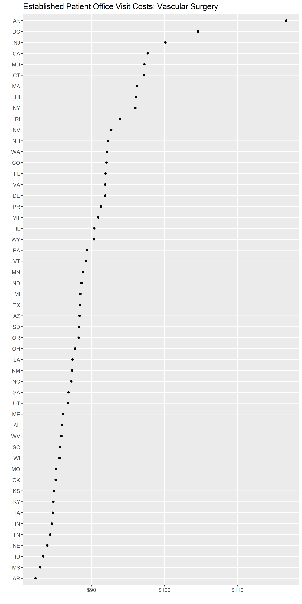
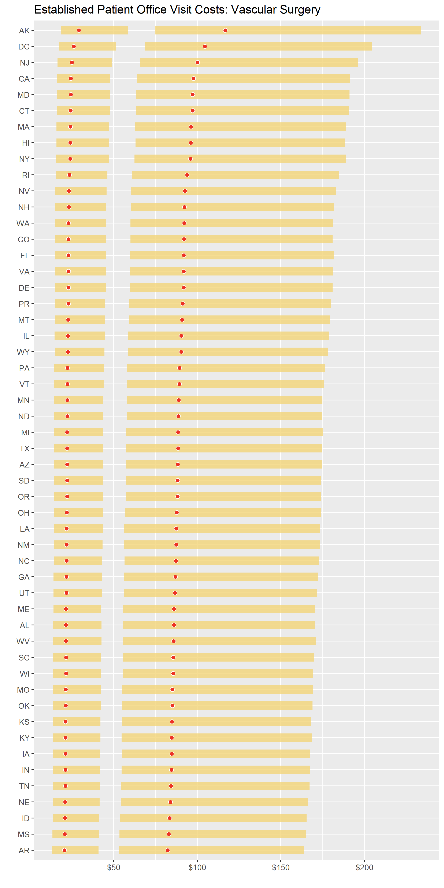

<!-- README.md is generated from README.Rmd. Please edit that file -->

# `costoffice` <a href="https://andrewallenbruce.github.io/costoffice/"></a>

<!-- badges: start -->

[](https://github.com/andrewallenbruce/costoffice/actions/workflows/R-CMD-check.yaml)
[](https://lifecycle.r-lib.org/articles/stages.html#experimental)
[](https://www.repostatus.org/#wip)
[](https://github.com/andrewallenbruce/costoffice)
[](https://github.com/andrewallenbruce/costoffice/commits/main)
[](https://www.codefactor.io/repository/github/andrewallenbruce/costoffice)
[](https://app.codecov.io/gh/andrewallenbruce/costoffice?branch=main)
<!-- badges: end -->

<br>

## Installation

You can install the development version of `costoffice` from
[GitHub](https://github.com/) with:

``` r
# install.packages("devtools")
devtools::install_github("andrewallenbruce/costoffice", build_vignettes = TRUE)
```

``` r
# install.packages("remotes")
remotes::install_github("andrewallenbruce/costoffice", build_vignettes = TRUE)
```

``` r
library(costoffice)
```

<br>

## Motivation

The `costoffice` package contains functions enabling the user to access
the latest **Physician Office Visit Costs** datasets from
[Data.CMS.gov](https://data.cms.gov/provider-data/search?page-size=50&theme=Physician%20office%20visit%20costs).

There are 83 datasets in total, each representing a different medical
specialty. Each one contains the:

- Most Utilized Procedure Code (HCPCS Level II aka CPT code)
- Minimum/Maximum/Mode Price Medicare Paid
- Minimum/Maximum/Mode Copay the Patient Paid

by zip code, for new and established patients both.

<br>

## `search_datasets()`

Returns dataset information such as title, dates concerning data
freshness and, most importantly, a csv download url.

<br>

Use the `specialty` argument to return only *exact* matches:

``` r
search_datasets(specialty = "cardiac surgery")
```

    #> # A tidytable: 1 × 6
    #>   specialty       title                 issued     modified   released   csv_url
    #>   <chr>           <chr>                 <date>     <date>     <date>     <chr>  
    #> 1 cardiac surgery Cardiac Surgery Offi… 2022-07-11 2022-07-11 2022-07-14 https:…

<br>

> Return a vector of the exact names of the medical specialties by
> simply calling `search_datasets()$specialty`.

<br>

<details closed>
<summary>
<span title="Click to Expand"> Available Medical Specialties </span>
</summary>

``` r

addiction medicine
advanced heart failure and transplant cardiology
allergy/ immunology
anesthesiology
cardiac surgery
cardiology
certified clinical nurse specialist
certified nurse midwife
certified registered nurse anesthetist (crna)
clinic or group practice
clinical cardiac electrophysiology
clinical laboratory
colorectal surgery (proctology)
critical care (intensivists)
dentist
dermatology
diagnostic radiology
emergency medicine
endocrinology
family practice
gastroenterology
general practice
general surgery
geriatric medicine
geriatric psychiatry
gynecological oncology
hand surgery
hematology
hematology-oncology
hematopoietic cell transplantation and cellular therapy
hospice and palliative care
hospitalist
infectious disease
internal medicine
interventional cardiology
interventional pain management
interventional radiology
licensed clinical social worker
mammography center
maxillofacial surgery
medical genetics and genomics
medical oncology
medical toxicology
nephrology
neurology
neuropsychiatry
neurosurgery
nuclear medicine
nurse practitioner
obstetrics &amp; gynecology
ophthalmology
optometry
oral surgery (dentist only)
orthopedic surgery
osteopathic manipulative medicine
otolaryngology
pain management
pathology
pediatric medicine
peripheral vascular disease
physical medicine and rehabilitation
physical therapist in private practice
physician assistant
plastic and reconstructive surgery
podiatry
preventive medicine
psychiatry
psychologist, clinical
public health or welfare agency
pulmonary disease
radiation oncology
registered dietitian or nutrition professional
rheumatology
sleep medicine
speech language pathologist
sports medicine
surgical oncology
thoracic surgery
undefined physician type
undersea and hyperbaric medicine
unknown supplier/provider specialty
urology
vascular surgery
```

</details>

<br>

Use the `keyword` argument to return *partial* matches:

``` r
search_datasets(keyword = "medicine")
```

    #> # A tidytable: 12 × 6
    #>    specialty                      title issued     modified   released   csv_url
    #>    <chr>                          <chr> <date>     <date>     <date>     <chr>  
    #>  1 addiction medicine             Addi… 2022-07-11 2022-07-11 2022-07-14 https:…
    #>  2 emergency medicine             Emer… 2022-07-11 2022-07-11 2022-07-14 https:…
    #>  3 geriatric medicine             Geri… 2022-07-11 2022-07-11 2022-07-14 https:…
    #>  4 internal medicine              Inte… 2022-07-11 2022-07-11 2022-07-14 https:…
    #>  5 nuclear medicine               Nucl… 2022-07-11 2022-07-11 2022-07-14 https:…
    #>  6 osteopathic manipulative medi… Oste… 2022-07-11 2022-07-11 2022-07-14 https:…
    #>  7 pediatric medicine             Pedi… 2022-07-11 2022-07-11 2022-07-14 https:…
    #>  8 physical medicine and rehabil… Phys… 2022-07-11 2022-07-11 2022-07-14 https:…
    #>  9 preventive medicine            Prev… 2022-07-11 2022-07-11 2022-07-14 https:…
    #> 10 sleep medicine                 Slee… 2022-07-11 2022-07-11 2022-07-14 https:…
    #> 11 sports medicine                Spor… 2022-07-11 2022-07-11 2022-07-14 https:…
    #> 12 undersea and hyperbaric medic… Unde… 2022-07-11 2022-07-11 2022-07-14 https:…

<br>

Calling the function with no arguments will return the entire dataset:

``` r
search_datasets()
```

    #> # A tidytable: 83 × 6
    #>    specialty                      title issued     modified   released   csv_url
    #>    <chr>                          <chr> <date>     <date>     <date>     <chr>  
    #>  1 addiction medicine             Addi… 2022-07-11 2022-07-11 2022-07-14 https:…
    #>  2 advanced heart failure and tr… Adva… 2022-07-11 2022-07-11 2022-07-14 https:…
    #>  3 allergy/ immunology            Alle… 2022-07-11 2022-07-11 2022-07-14 https:…
    #>  4 anesthesiology                 Anes… 2022-07-11 2022-07-11 2022-07-14 https:…
    #>  5 cardiac surgery                Card… 2022-07-11 2022-07-11 2022-07-14 https:…
    #>  6 cardiology                     Card… 2022-07-11 2022-07-11 2022-07-14 https:…
    #>  7 certified clinical nurse spec… Cert… 2022-07-11 2022-07-11 2022-07-14 https:…
    #>  8 certified nurse midwife        Cert… 2022-07-11 2022-07-11 2022-07-14 https:…
    #>  9 certified registered nurse an… Cert… 2022-07-11 2022-07-11 2022-07-14 https:…
    #> 10 clinic or group practice       Clin… 2022-07-11 2022-07-11 2022-07-14 https:…
    #> # ℹ 73 more rows

<br>

## `download_dataset()`

Once you’ve found the dataset that you’re interested in, simply insert
the `download_dataset()` function into your pipeline to download the csv
file, which is returned as a `tidytable`:

``` r
search_datasets(specialty = "vascular surgery") |> 
  download_dataset() |> 
  head(n = 10)
```

    #> # A tidytable: 10 × 9
    #>    specialty        zip_code hcpcs patient cost    min   max  mode range
    #>    <chr>            <chr>    <chr> <chr>   <chr> <dbl> <dbl> <dbl> <dbl>
    #>  1 vascular surgery 00210    99203 new     copay  15.0  45.4  23.1  30.4
    #>  2 vascular surgery 00210    99203 new     price  60.1 182.   92.3 121. 
    #>  3 vascular surgery 00211    99203 new     copay  15.0  45.4  23.1  30.4
    #>  4 vascular surgery 00211    99203 new     price  60.1 182.   92.3 121. 
    #>  5 vascular surgery 00212    99203 new     copay  15.0  45.4  23.1  30.4
    #>  6 vascular surgery 00212    99203 new     price  60.1 182.   92.3 121. 
    #>  7 vascular surgery 00213    99203 new     copay  15.0  45.4  23.1  30.4
    #>  8 vascular surgery 00213    99203 new     price  60.1 182.   92.3 121. 
    #>  9 vascular surgery 00214    99203 new     copay  15.0  45.4  23.1  30.4
    #> 10 vascular surgery 00214    99203 new     price  60.1 182.   92.3 121.

<br>

## `use_zipcoder()`

`costoffice` includes a subset of zip code-related data from Gavin
Rozzi’s amazing `zipcodeR` package. Piping the downloaded dataset into
the `use_zipcoder()` function adds this information to the data frame.

``` r
search_datasets(specialty = "vascular surgery") |> 
  download_dataset() |> 
  tidytable::slice_sample(n = 10) |> 
  use_zipcoder(full = TRUE)
```

    #> # A tidytable: 10 × 18
    #>    specialty   city  county state zip_code hcpcs patient cost    min   max  mode
    #>    <chr>       <chr> <chr>  <chr> <chr>    <chr> <chr>   <chr> <dbl> <dbl> <dbl>
    #>  1 vascular s… Yabu… Yabuc… PR    00767    99203 new     price 59.4  180.   91.3
    #>  2 vascular s… Sing… Rocki… VA    22850    99213 est     price 18.3  146.   73.5
    #>  3 vascular s… Wayne DuPag… IL    60184    99213 est     copay  4.85  38.5  19.4
    #>  4 vascular s… Tefft Jaspe… IN    46380    99213 est     copay  4.24  34.3  17.2
    #>  5 vascular s… Edwa… Eagle… CO    81632    99213 est     copay  4.75  37.0  18.8
    #>  6 vascular s… Marcy Oneid… NY    13403    99213 est     price 17.8  142.   71.7
    #>  7 vascular s… Bayp… Washi… MN    55003    99203 new     price 58.0  175.   88.8
    #>  8 vascular s… New … Bowie… TX    75570    99203 new     copay 14.2   43.2  21.8
    #>  9 vascular s… Holl… Erie … NY    14080    99213 est     copay  4.44  35.6  17.9
    #> 10 vascular s… Brad… Washi… RI    02808    99203 new     copay 15.3   46.2  23.5
    #> # ℹ 7 more variables: range <dbl>, state_name <chr>, state_region <fct>,
    #> #   demo <list>, geo <list>, is_zcta <lgl>, zcta_crosswalk <list>

<br>

## `download_datasets()`

The `download_datasets()` function wraps the previous three functions
into a one-stop shop of sorts. Arguments from all three base functions
are accessible as well.

``` r
(x <- download_datasets(specialty = "vascular surgery") |> head())
```

    #> # A tidytable: 6 × 14
    #>   specialty    city  county state zip_code hcpcs patient cost    min   max  mode
    #>   <chr>        <chr> <chr>  <chr> <chr>    <chr> <chr>   <chr> <dbl> <dbl> <dbl>
    #> 1 vascular su… Holt… Suffo… NY    00501    99203 new     copay  17.9  53.8  27.4
    #> 2 vascular su… Holt… Suffo… NY    00501    99203 new     price  71.5 215.  110. 
    #> 3 vascular su… Holt… Suffo… NY    00544    99203 new     copay  17.9  53.8  27.4
    #> 4 vascular su… Holt… Suffo… NY    00544    99203 new     price  71.5 215.  110. 
    #> 5 vascular su… Adju… Adjun… PR    00601    99203 new     copay  14.8  45.0  22.8
    #> 6 vascular su… Adju… Adjun… PR    00601    99203 new     price  59.4 180.   91.3
    #> # ℹ 3 more variables: range <dbl>, state_name <chr>, state_region <fct>

<br>

``` r
(y <- download_datasets(keyword = "anesthesiology") |> head())
```

    #> # A tidytable: 6 × 14
    #>   specialty    city  county state zip_code hcpcs patient cost    min   max  mode
    #>   <chr>        <chr> <chr>  <chr> <chr>    <chr> <chr>   <chr> <dbl> <dbl> <dbl>
    #> 1 anesthesiol… Holt… Suffo… NY    00501    99204 new     copay  17.9  53.8  40.7
    #> 2 anesthesiol… Holt… Suffo… NY    00501    99204 new     price  71.5 215.  163. 
    #> 3 anesthesiol… Holt… Suffo… NY    00544    99204 new     copay  17.9  53.8  40.7
    #> 4 anesthesiol… Holt… Suffo… NY    00544    99204 new     price  71.5 215.  163. 
    #> 5 anesthesiol… Adju… Adjun… PR    00601    99204 new     copay  14.8  45.0  34.1
    #> 6 anesthesiol… Adju… Adjun… PR    00601    99204 new     price  59.4 180.  136. 
    #> # ℹ 3 more variables: range <dbl>, state_name <chr>, state_region <fct>

<br>

## `summary_stats()`

`summary_stats()` is a versatile summary function, tailored for the data
this package accesses.

Current average prices by state for a **New Patient** office visit to a
**Vascular Surgeon**:

``` r
(vasc <- download_datasets(specialty = "vascular surgery") |> 
  summary_stats(condition = patient == "new",
                group_vars = c(specialty, state, hcpcs, cost),
                summary_vars = c(min, max, mode, range),
                arr = cost))
```

    #> # A tidytable: 104 × 13
    #>    specialty        state hcpcs cost  median_min mean_min median_max mean_max
    #>    <chr>            <chr> <chr> <chr>      <dbl>    <dbl>      <dbl>    <dbl>
    #>  1 vascular surgery AK    99203 price       74.8     74.8       234.     234.
    #>  2 vascular surgery AL    99203 price       55.5     55.5       171.     171.
    #>  3 vascular surgery AR    99203 price       53.1     53.1       164.     164.
    #>  4 vascular surgery AZ    99203 price       57.3     57.3       175.     175.
    #>  5 vascular surgery CA    99203 price       63.6     64.0       190.     191.
    #>  6 vascular surgery CO    99203 price       60.1     60.1       181.     181.
    #>  7 vascular surgery CT    99203 price       63.5     63.5       191.     191.
    #>  8 vascular surgery DC    99203 price       68.6     68.6       205.     205.
    #>  9 vascular surgery DE    99203 price       59.8     59.8       181.     181.
    #> 10 vascular surgery FL    99203 price       58.4     59.5       179.     182.
    #> # ℹ 94 more rows
    #> # ℹ 5 more variables: median_mode <dbl>, mean_mode <dbl>, median_range <dbl>,
    #> #   mean_range <dbl>, n <int>

<br>

Average prices by state for an **Established Patient** office visit to a
**Cardiologist**:

``` r
download_datasets(specialty = "cardiology", full = TRUE) |> 
  tidytable::select(!c(geo, is_zcta, zcta_crosswalk)) |> 
  tidytable::unnest(demo) |> 
  tidytable::group_by(state, zip_code) |> 
  tidytable::summarise(n = tidytable::n.(),
                       pop = sum(pop, na.rm = TRUE))
```

    #> # A tidytable: 41,871 × 4
    #> # Groups:      state
    #>    state zip_code     n    pop
    #>    <chr> <chr>    <int>  <int>
    #>  1 AK    99501        4  70412
    #>  2 AK    99502        4  96672
    #>  3 AK    99503        4  58252
    #>  4 AK    99504        4 163656
    #>  5 AK    99505        4  24696
    #>  6 AK    99506        4  30996
    #>  7 AK    99507        4 151400
    #>  8 AK    99508        4 143428
    #>  9 AK    99509        4      0
    #> 10 AK    99510        4   1412
    #> # ℹ 41,861 more rows

``` r
costoffice::zip_db |> 
  tidytable::unnest(demo) |> 
  tidytable::group_by(state) |> 
  tidytable::summarise(no_zips = tidytable::n.(),
                       pop_sum = sum(pop, na.rm = TRUE),
                       mean_pop_dens = mean(pop_density, na.rm = TRUE),
                       med_income = median(med_income, na.rm = TRUE))
```

    #> # A tidytable: 52 × 5
    #>    state no_zips  pop_sum mean_pop_dens med_income
    #>    <chr>   <int>    <int>         <dbl>      <dbl>
    #>  1 AK        274   709930          229.      48036
    #>  2 AL        839  4779588          360.      38493
    #>  3 AR        710  2916042          209.      36104
    #>  4 AZ        568  6394519         1169.      42734
    #>  5 CA       2654 37249542         3273.      56528
    #>  6 CO        662  5029374          989.      51937
    #>  7 CT        438  3574097         1627.      78122
    #>  8 DC        296   601723        20318.      76948
    #>  9 DE         98   897925         1780.      57292
    #> 10 FL       1495 18801226         1955.      45593
    #> # ℹ 42 more rows

``` r
(cardio <- download_datasets(specialty = "cardiology") |> 
  summary_stats(condition = patient == "est",
                group_vars = c(specialty, state, hcpcs, cost),
                summary_vars = c(min, max, mode, range),
                arr = cost))
```

    #> # A tidytable: 104 × 13
    #>    specialty  state hcpcs cost  median_min mean_min median_max mean_max
    #>    <chr>      <chr> <chr> <chr>      <dbl>    <dbl>      <dbl>    <dbl>
    #>  1 cardiology AK    99214 price       22.4     22.4       191.     191.
    #>  2 cardiology AL    99214 price       16.9     16.9       139.     139.
    #>  3 cardiology AR    99214 price       16.3     16.3       134.     134.
    #>  4 cardiology AZ    99214 price       17.7     17.7       143.     143.
    #>  5 cardiology CA    99214 price       20.4     20.5       156.     157.
    #>  6 cardiology CO    99214 price       19.0     19.0       148.     148.
    #>  7 cardiology CT    99214 price       20.1     20.1       156.     156.
    #>  8 cardiology DC    99214 price       21.9     21.9       167.     167.
    #>  9 cardiology DE    99214 price       18.7     18.7       148.     148.
    #> 10 cardiology FL    99214 price       17.7     18.1       145.     148.
    #> # ℹ 94 more rows
    #> # ℹ 5 more variables: median_mode <dbl>, mean_mode <dbl>, median_range <dbl>,
    #> #   mean_range <dbl>, n <int>

<br>

## Plots

``` r
ggplot2::ggplot(vasc |> tidytable::filter(cost == "price"), 
  ggplot2::aes(forcats::fct_reorder(state, mean_mode, median), mean_mode)) +
  ggplot2::geom_point() +
  ggplot2::coord_flip() +
  ggplot2::scale_y_continuous(labels = scales::label_dollar()) +
  ggplot2::labs(x = "", y = "",
           title = "Established Patient Office Visit Costs: Vascular Surgery")
```

 <br>

``` r
ggplot2::ggplot(data = vasc, ggplot2::aes(x = reorder(state, mean_mode), y = mean_mode)) +
  ggplot2::geom_linerange(ggplot2::aes(ymin = mean_min, ymax = mean_max), 
                          color = "#f3d478", linewidth = 4.5, alpha = 0.8) +
  ggplot2::geom_point(fill = "#ed3324", color = "white", size = 2, shape = 21) +
  ggplot2::coord_flip() +
  ggplot2::scale_y_continuous(labels = scales::label_dollar()) +
  ggplot2::labs(x = "", y = "",
           title = "Established Patient Office Visit Costs: Vascular Surgery")
```



<br>

## `write_datasets()`

``` r
write_datasets()
```

<br>

``` r
fs::dir_info("D:/cost_office_csvs/") |> 
  tidytable::select(path, size)
```

    #> # A tidytable: 83 × 2
    #>    path                                                                     size
    #>    <fs::path>                                                              <fs:>
    #>  1 D:/cost_office_csvs/addiction medicine.csv                              18.6M
    #>  2 …/cost_office_csvs/advanced heart failure and transplant cardiology.csv 23.4M
    #>  3 D:/cost_office_csvs/allergy immunology.csv                              18.7M
    #>  4 D:/cost_office_csvs/anesthesiology.csv                                  17.9M
    #>  5 D:/cost_office_csvs/cardiac surgery.csv                                 18.1M
    #>  6 D:/cost_office_csvs/cardiology.csv                                      17.3M
    #>  7 D:/cost_office_csvs/certified clinical nurse specialist.csv             21.3M
    #>  8 D:/cost_office_csvs/certified nurse midwife.csv                         19.3M
    #>  9 D:/cost_office_csvs/certified registered nurse anesthetist (crna).csv   22.8M
    #> 10 D:/cost_office_csvs/clinic or group practice.csv                        19.5M
    #> # ℹ 73 more rows

<br>

Size on disk:

``` r
fs::dir_info("D:/cost_office_csvs/") |> 
  tidytable::select(path, size) |> 
  tidytable::summarise(sum(size)) |> 
  tibble::deframe()
```

    #> 1.5G

<br>

## `write_duckdb`

``` r
write_duckdb <- function(dir = "D:/cost_office_csvs/",
                         db_dir = "D:/cost_office_duckdb/",
                         db_name = "cost_office.duckdb")
```

<br>

``` r
con <- duckdb::dbConnect(
  drv = duckdb::duckdb(), 
  dbdir = "D:/cost_office_duckdb/cost_office.duckdb")

dplyr::tbl(con, "psychiatry")
```

    #> # Source:   table<psychiatry> [?? x 14]
    #> # Database: DuckDB 0.7.1 [andyb@Windows 10 x64:R 4.2.2/D:/cost_office_duckdb/cost_office.duckdb]
    #>    specialty  city   county state zip_code hcpcs patient cost    min   max  mode
    #>    <chr>      <chr>  <chr>  <chr>    <int> <int> <chr>   <chr> <dbl> <dbl> <dbl>
    #>  1 psychiatry Holts… Suffo… NY         501 99205 new     copay  17.9  53.8  53.8
    #>  2 psychiatry Holts… Suffo… NY         501 99205 new     price  71.5 215.  215. 
    #>  3 psychiatry Holts… Suffo… NY         544 99205 new     copay  17.9  53.8  53.8
    #>  4 psychiatry Holts… Suffo… NY         544 99205 new     price  71.5 215.  215. 
    #>  5 psychiatry Adjun… Adjun… PR         601 99205 new     copay  14.8  45.0  45.0
    #>  6 psychiatry Adjun… Adjun… PR         601 99205 new     price  59.4 180.  180. 
    #>  7 psychiatry Aguada Aguad… PR         602 99205 new     copay  14.8  45.0  45.0
    #>  8 psychiatry Aguada Aguad… PR         602 99205 new     price  59.4 180.  180. 
    #>  9 psychiatry Aguad… Aguad… PR         603 99205 new     copay  14.8  45.0  45.0
    #> 10 psychiatry Aguad… Aguad… PR         603 99205 new     price  59.4 180.  180. 
    #> # ℹ more rows
    #> # ℹ 3 more variables: range <dbl>, state_name <chr>, state_region <chr>

<br>

``` r
duckdb::duckdb_shutdown(drv)
```

    #> Error in is(drv, "duckdb_driver"): object 'drv' not found

Size on disk:

``` r
fs::dir_info("D:/cost_office_duckdb/") |> 
  tidytable::select(path, size) |> 
  tidytable::summarise(sum(size)) |> 
  tibble::deframe()
```

    #> 355M

## Code of Conduct

Please note that the `costoffice` project is released with a
[Contributor Code of
Conduct](https://andrewallenbruce.github.io/costoffice/CODE_OF_CONDUCT.html).
By contributing to this project, you agree to abide by its terms.
