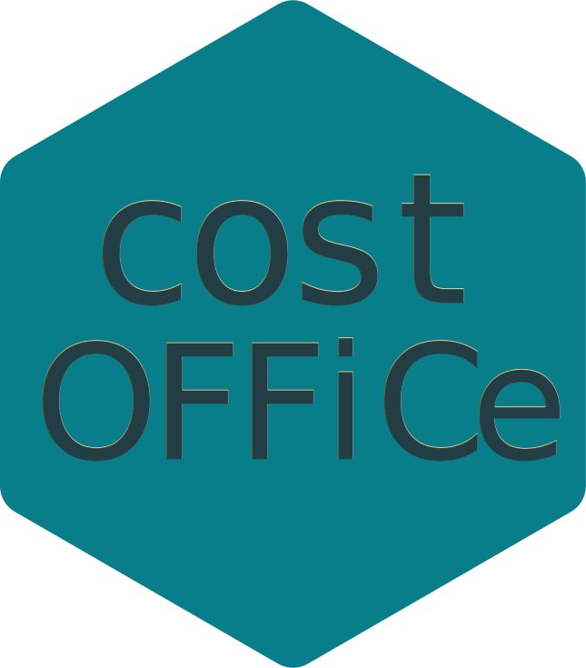
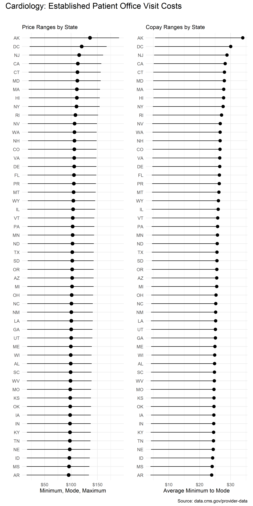

<!-- README.md is generated from README.Rmd. Please edit that file -->

# `costoffice` <a href="https://andrewallenbruce.github.io/costoffice/"></a>

<!-- badges: start -->

[](https://github.com/andrewallenbruce/costoffice/actions/workflows/R-CMD-check.yaml)
[](https://lifecycle.r-lib.org/articles/stages.html#experimental)
[](https://www.repostatus.org/#wip)
[](https://github.com/andrewallenbruce/costoffice)
[](https://github.com/andrewallenbruce/costoffice/commits/main)
[](https://www.codefactor.io/repository/github/andrewallenbruce/costoffice)
[](https://app.codecov.io/gh/andrewallenbruce/costoffice?branch=main)
<!-- badges: end -->

<br>

## Installation

You can install the development version of `costoffice` from
[GitHub](https://github.com/) with:

``` r
# install.packages("devtools")
devtools::install_github("andrewallenbruce/costoffice")
```

``` r
# install.packages("remotes")
remotes::install_github("andrewallenbruce/costoffice")
```

<br>

## Retrieve Dataset Info

``` r
library(costoffice)
```

<br>

To retrieve information on all of the data sets (83 specialties in
total), simply call `search_datasets()` with no arguments:

``` r
search_datasets()
```

    #> # A tidytable: 83 × 5
    #>    specialty                            issued     modified   released   csv_url
    #>    <chr>                                <date>     <date>     <date>     <chr>  
    #>  1 addiction medicine                   2022-07-11 2022-07-11 2022-07-14 https:…
    #>  2 advanced heart failure and transpla… 2022-07-11 2022-07-11 2022-07-14 https:…
    #>  3 allergy/ immunology                  2022-07-11 2022-07-11 2022-07-14 https:…
    #>  4 anesthesiology                       2022-07-11 2022-07-11 2022-07-14 https:…
    #>  5 cardiac surgery                      2022-07-11 2022-07-11 2022-07-14 https:…
    #>  6 cardiology                           2022-07-11 2022-07-11 2022-07-14 https:…
    #>  7 certified clinical nurse specialist  2022-07-11 2022-07-11 2022-07-14 https:…
    #>  8 certified nurse midwife              2022-07-11 2022-07-11 2022-07-14 https:…
    #>  9 certified registered nurse anesthet… 2022-07-11 2022-07-11 2022-07-14 https:…
    #> 10 clinic or group practice             2022-07-11 2022-07-11 2022-07-14 https:…
    #> # ℹ 73 more rows

<br>

Search specialties by keyword:

``` r
search_datasets(keyword = "medicine")
```

    #> # A tidytable: 12 × 5
    #>    specialty                            issued     modified   released   csv_url
    #>    <chr>                                <date>     <date>     <date>     <chr>  
    #>  1 addiction medicine                   2022-07-11 2022-07-11 2022-07-14 https:…
    #>  2 emergency medicine                   2022-07-11 2022-07-11 2022-07-14 https:…
    #>  3 geriatric medicine                   2022-07-11 2022-07-11 2022-07-14 https:…
    #>  4 internal medicine                    2022-07-11 2022-07-11 2022-07-14 https:…
    #>  5 nuclear medicine                     2022-07-11 2022-07-11 2022-07-14 https:…
    #>  6 osteopathic manipulative medicine    2022-07-11 2022-07-11 2022-07-14 https:…
    #>  7 pediatric medicine                   2022-07-11 2022-07-11 2022-07-14 https:…
    #>  8 physical medicine and rehabilitation 2022-07-11 2022-07-11 2022-07-14 https:…
    #>  9 preventive medicine                  2022-07-11 2022-07-11 2022-07-14 https:…
    #> 10 sleep medicine                       2022-07-11 2022-07-11 2022-07-14 https:…
    #> 11 sports medicine                      2022-07-11 2022-07-11 2022-07-14 https:…
    #> 12 undersea and hyperbaric medicine     2022-07-11 2022-07-11 2022-07-14 https:…

<br>

If you’re searching for one in particular, just supply the `specialty`
argument:

``` r
search_datasets(specialty = "cardiac surgery") |> tidytable::glimpse()
```

    #> Rows: 1
    #> Columns: 5
    #> $ specialty <chr> "cardiac surgery"
    #> $ issued    <date> 2022-07-11
    #> $ modified  <date> 2022-07-11
    #> $ released  <date> 2022-07-14
    #> $ csv_url   <chr> "https://data.cms.gov/provider-data/sites/default/files/reso…

<br>

## Downloading A Dataset

Each dataset has approximately 43k rows and is roughly 8 MB.

``` r
search_datasets(specialty = "vascular surgery") |> 
  download_dataset() |> 
  tidytable::slice_sample(n = 10) |> 
  knitr::kable()
```

| specialty        | zip_code | new_code | new_price_min | new_price_max | new_price_mode | new_copay_min | new_copay_max | new_copay_mode | est_code | est_price_min | est_price_max | est_price_mode | est_copay_min | est_copay_max | est_copay_mode |
|:-----------------|:---------|:---------|--------------:|--------------:|---------------:|--------------:|--------------:|---------------:|:---------|--------------:|--------------:|---------------:|--------------:|--------------:|---------------:|
| vascular surgery | 68018    | 99203    |        54.432 |       166.144 |         83.920 |        13.608 |        41.536 |         20.980 | 99213    |        17.000 |       136.312 |         68.624 |         4.250 |        34.078 |         17.156 |
| vascular surgery | 58422    | 99203    |        57.752 |       174.568 |         88.616 |        14.438 |        43.642 |         22.154 | 99213    |        18.264 |       143.216 |         72.384 |         4.566 |        35.804 |         18.096 |
| vascular surgery | 54452    | 99203    |        55.632 |       169.160 |         85.608 |        13.908 |        42.290 |         21.402 | 99213    |        17.464 |       138.800 |         69.984 |         4.366 |        34.700 |         17.496 |
| vascular surgery | 73703    | 99203    |        54.976 |       168.904 |         85.072 |        13.744 |        42.226 |         21.268 | 99213    |        16.800 |       137.832 |         69.216 |         4.200 |        34.458 |         17.304 |
| vascular surgery | 51038    | 99203    |        54.880 |       167.712 |         84.672 |        13.720 |        41.928 |         21.168 | 99213    |        17.040 |       137.368 |         69.120 |         4.260 |        34.342 |         17.280 |
| vascular surgery | 77445    | 99203    |        56.752 |       172.600 |         87.360 |        14.188 |        43.150 |         21.840 | 99213    |        17.720 |       141.296 |         71.240 |         4.430 |        35.324 |         17.810 |
| vascular surgery | 43031    | 99203    |        56.744 |       173.944 |         87.728 |        14.186 |        43.486 |         21.932 | 99213    |        17.312 |       141.664 |         71.200 |         4.328 |        35.416 |         17.800 |
| vascular surgery | 97391    | 99203    |        56.384 |       171.592 |         86.824 |        14.096 |        42.898 |         21.706 | 99213    |        17.600 |       140.512 |         70.824 |         4.400 |        35.128 |         17.706 |
| vascular surgery | 65217    | 99203    |        54.200 |       167.176 |         84.040 |        13.550 |        41.794 |         21.010 | 99213    |        16.432 |       136.288 |         68.328 |         4.108 |        34.072 |         17.082 |
| vascular surgery | 99649    | 99203    |        74.816 |       233.632 |        116.688 |        18.704 |        58.408 |         29.172 | 99213    |        22.376 |       190.744 |         95.160 |         5.594 |        47.686 |         23.790 |

<br>

## Geocoding with `zipcodeR`

``` r
search_datasets(specialty = "vascular surgery") |> 
  download_dataset() |> 
  tidytable::slice_sample(n = 10) |> 
  use_zipcoder() |> 
  knitr::kable()
```

| city       | county            | state | zip_code | specialty        | new_code | new_price_min | new_price_max | new_price_mode | new_copay_min | new_copay_max | new_copay_mode | est_code | est_price_min | est_price_max | est_price_mode | est_copay_min | est_copay_max | est_copay_mode |   lat |     lng | bounds_west | bounds_east | bounds_north | bounds_south |
|:-----------|:------------------|:------|:---------|:-----------------|:---------|--------------:|--------------:|---------------:|--------------:|--------------:|---------------:|:---------|--------------:|--------------:|---------------:|--------------:|--------------:|---------------:|------:|--------:|------------:|------------:|-------------:|-------------:|
| Kirkland   | King County       | WA    | 98083    | vascular surgery | 99203    |        65.504 |       195.256 |         99.848 |        16.376 |        48.814 |         24.962 | 99213    |        21.088 |       160.184 |         81.424 |         5.272 |        40.046 |         20.356 |    NA |      NA |          NA |          NA |           NA |           NA |
| Juniata    | Adams County      | NE    | 68955    | vascular surgery | 99203    |        54.432 |       166.144 |         83.920 |        13.608 |        41.536 |         20.980 | 99213    |        17.000 |       136.312 |         68.624 |         4.250 |        34.078 |         17.156 | 40.60 |  -98.50 |   -98.64815 |   -98.43039 |     40.69865 |     40.49532 |
| Techny     | Cook County       | IL    | 60082    | vascular surgery | 99203    |        63.000 |       191.320 |         96.992 |        15.750 |        47.830 |         24.248 | 99213    |        19.296 |       155.264 |         78.336 |         4.824 |        38.816 |         19.584 |    NA |      NA |          NA |          NA |           NA |           NA |
| NA         | NA                | NA    | 96932    | vascular surgery | 99203    |        63.016 |       188.112 |         96.112 |        15.754 |        47.028 |         24.028 | 99213    |        20.256 |       154.368 |         78.416 |         5.064 |        38.592 |         19.604 |    NA |      NA |          NA |          NA |           NA |           NA |
| Whitewater | Phillips County   | MT    | 59544    | vascular surgery | 99203    |        59.120 |       179.288 |         90.904 |        14.780 |        44.822 |         22.726 | 99213    |        18.416 |       146.416 |         73.912 |         4.604 |        36.604 |         18.478 | 48.80 | -107.50 |  -107.86183 |  -107.17986 |     49.00003 |     48.62560 |
| Middletown | Henry County      | IN    | 47356    | vascular surgery | 99203    |        54.768 |       167.544 |         84.544 |        13.692 |        41.886 |         21.136 | 99213    |        16.960 |       137.160 |         68.992 |         4.240 |        34.290 |         17.248 | 40.03 |  -85.51 |   -85.60537 |   -85.40396 |     40.08387 |     39.96103 |
| Darrington | Snohomish County  | WA    | 98241    | vascular surgery | 99203    |        58.968 |       178.296 |         90.520 |        14.742 |        44.574 |         22.630 | 99213    |        18.536 |       145.928 |         73.744 |         4.634 |        36.482 |         18.436 | 48.30 | -121.60 |  -121.68820 |  -120.90621 |     48.38452 |     48.02589 |
| East Derry | Rockingham County | NH    | 03041    | vascular surgery | 99203    |        60.136 |       181.552 |         92.256 |        15.034 |        45.388 |         23.064 | 99213    |        18.896 |       148.440 |         75.064 |         4.724 |        37.110 |         18.766 |    NA |      NA |          NA |          NA |           NA |           NA |
| NA         | NA                | NA    | 24821    | vascular surgery | 99203    |        55.312 |       170.816 |         85.848 |        13.828 |        42.704 |         21.462 | 99213    |        16.616 |       138.832 |         69.568 |         4.154 |        34.708 |         17.392 |    NA |      NA |          NA |          NA |           NA |           NA |
| Judson     | Gregg County      | TX    | 75660    | vascular surgery | 99203    |        56.752 |       172.600 |         87.360 |        14.188 |        43.150 |         21.840 | 99213    |        17.720 |       141.296 |         71.240 |         4.430 |        35.324 |         17.810 |    NA |      NA |          NA |          NA |           NA |           NA |

<br>

## Summary Statistics by State

Current average prices by state for a **New Patient** office visit to a
**Vascular Surgeon**:

``` r
search_datasets(specialty = "vascular surgery") |> 
  download_dataset() |> 
  use_zipcoder() |> 
  tidytable::select(specialty, 
                    state, 
                    tidytable::starts_with("new_")) |> 
  tidytable::summarise(avg_price_mode = round(mean(new_price_mode), 2),
                       avg_copay_mode = round(mean(new_copay_mode), 2),
                       .by = c(specialty, 
                               state, 
                               new_code)) |> 
  tidytable::drop_na() |> 
  knitr::kable()
```

| specialty        | state | new_code | avg_price_mode | avg_copay_mode |
|:-----------------|:------|:---------|---------------:|---------------:|
| vascular surgery | AK    | 99203    |         116.69 |          29.17 |
| vascular surgery | AL    | 99203    |          85.95 |          21.49 |
| vascular surgery | AR    | 99203    |          82.31 |          20.58 |
| vascular surgery | AZ    | 99203    |          88.34 |          22.08 |
| vascular surgery | CA    | 99203    |          97.69 |          24.42 |
| vascular surgery | CO    | 99203    |          92.05 |          23.01 |
| vascular surgery | CT    | 99203    |          97.18 |          24.30 |
| vascular surgery | DC    | 99203    |         104.59 |          26.15 |
| vascular surgery | DE    | 99203    |          91.85 |          22.96 |
| vascular surgery | FL    | 99203    |          91.92 |          22.98 |
| vascular surgery | GA    | 99203    |          86.83 |          21.71 |
| vascular surgery | HI    | 99203    |          96.11 |          24.03 |
| vascular surgery | IA    | 99203    |          84.67 |          21.17 |
| vascular surgery | ID    | 99203    |          83.37 |          20.84 |
| vascular surgery | IL    | 99203    |          90.37 |          22.59 |
| vascular surgery | IN    | 99203    |          84.54 |          21.14 |
| vascular surgery | KS    | 99203    |          84.86 |          21.21 |
| vascular surgery | KY    | 99203    |          84.75 |          21.19 |
| vascular surgery | LA    | 99203    |          87.37 |          21.84 |
| vascular surgery | MA    | 99203    |          96.24 |          24.06 |
| vascular surgery | MD    | 99203    |          97.23 |          24.31 |
| vascular surgery | ME    | 99203    |          86.06 |          21.51 |
| vascular surgery | MI    | 99203    |          88.46 |          22.12 |
| vascular surgery | MN    | 99203    |          88.84 |          22.21 |
| vascular surgery | MO    | 99203    |          85.12 |          21.28 |
| vascular surgery | MS    | 99203    |          82.96 |          20.74 |
| vascular surgery | MT    | 99203    |          90.90 |          22.73 |
| vascular surgery | NC    | 99203    |          87.21 |          21.80 |
| vascular surgery | ND    | 99203    |          88.62 |          22.15 |
| vascular surgery | NE    | 99203    |          83.92 |          20.98 |
| vascular surgery | NH    | 99203    |          92.26 |          23.06 |
| vascular surgery | NJ    | 99203    |         100.13 |          25.03 |
| vascular surgery | NM    | 99203    |          87.31 |          21.83 |
| vascular surgery | NV    | 99203    |          92.70 |          23.17 |
| vascular surgery | NY    | 99203    |          96.01 |          24.00 |
| vascular surgery | OH    | 99203    |          87.73 |          21.93 |
| vascular surgery | OK    | 99203    |          85.07 |          21.27 |
| vascular surgery | OR    | 99203    |          88.22 |          22.06 |
| vascular surgery | PA    | 99203    |          89.32 |          22.33 |
| vascular surgery | PR    | 99203    |          91.28 |          22.82 |
| vascular surgery | RI    | 99203    |          93.88 |          23.47 |
| vascular surgery | SC    | 99203    |          85.63 |          21.41 |
| vascular surgery | SD    | 99203    |          88.26 |          22.07 |
| vascular surgery | TN    | 99203    |          84.32 |          21.08 |
| vascular surgery | TX    | 99203    |          88.43 |          22.11 |
| vascular surgery | UT    | 99203    |          86.74 |          21.69 |
| vascular surgery | VA    | 99203    |          91.87 |          22.97 |
| vascular surgery | VT    | 99203    |          89.24 |          22.31 |
| vascular surgery | WA    | 99203    |          92.12 |          23.03 |
| vascular surgery | WI    | 99203    |          85.61 |          21.40 |
| vascular surgery | WV    | 99203    |          85.85 |          21.46 |
| vascular surgery | WY    | 99203    |          90.34 |          22.58 |

<br>

Current average prices by state for an **Established Patient** office
visit to a **Cardiologist**:

``` r
est_cardio <- search_datasets(specialty = "cardiology") |> 
  download_dataset() |> 
  use_zipcoder() |> 
  tidytable::select(specialty, 
                    state, 
                    tidytable::starts_with("est_")) |> 
  tidytable::summarise(
    avg_price_min = round(mean(est_price_min), 2),
    avg_price_mode = round(mean(est_price_mode), 2),
    avg_price_max = round(mean(est_price_max), 2),
    avg_copay_min = round(mean(est_copay_min), 2),
    avg_copay_mode = round(mean(est_copay_mode), 2),
    avg_copay_max = round(mean(est_copay_min), 2),
                       .by = c(specialty, 
                               state, 
                               est_code)) |> 
  tidytable::drop_na()

est_cardio |> knitr::kable()
```

| specialty  | state | est_code | avg_price_min | avg_price_mode | avg_price_max | avg_copay_min | avg_copay_mode | avg_copay_max |
|:-----------|:------|:---------|--------------:|---------------:|--------------:|--------------:|---------------:|--------------:|
| cardiology | AK    | 99214    |         22.38 |         135.85 |        190.74 |          5.59 |          33.96 |          5.59 |
| cardiology | AL    | 99214    |         16.94 |          99.34 |        139.09 |          4.23 |          24.83 |          4.23 |
| cardiology | AR    | 99214    |         16.26 |          95.61 |        133.85 |          4.07 |          23.90 |          4.07 |
| cardiology | AZ    | 99214    |         17.74 |         102.07 |        142.65 |          4.44 |          25.52 |          4.44 |
| cardiology | CA    | 99214    |         20.49 |         112.92 |        157.12 |          5.12 |          28.23 |          5.12 |
| cardiology | CO    | 99214    |         18.98 |         106.33 |        148.20 |          4.75 |          26.58 |          4.75 |
| cardiology | CT    | 99214    |         20.09 |         112.10 |        156.18 |          5.02 |          28.02 |          5.02 |
| cardiology | DC    | 99214    |         21.87 |         120.20 |        167.25 |          5.47 |          30.05 |          5.47 |
| cardiology | DE    | 99214    |         18.72 |         105.98 |        147.89 |          4.68 |          26.50 |          4.68 |
| cardiology | FL    | 99214    |         18.06 |         105.48 |        147.69 |          4.52 |          26.37 |          4.52 |
| cardiology | GA    | 99214    |         17.23 |         100.34 |        140.40 |          4.31 |          25.08 |          4.31 |
| cardiology | HI    | 99214    |         20.26 |         111.01 |        154.37 |          5.06 |          27.75 |          5.06 |
| cardiology | IA    | 99214    |         17.04 |          98.30 |        137.37 |          4.26 |          24.57 |          4.26 |
| cardiology | ID    | 99214    |         16.65 |          96.84 |        135.44 |          4.16 |          24.21 |          4.16 |
| cardiology | IL    | 99214    |         17.84 |         103.97 |        145.52 |          4.46 |          25.99 |          4.46 |
| cardiology | IN    | 99214    |         16.96 |          98.12 |        137.16 |          4.24 |          24.53 |          4.24 |
| cardiology | KS    | 99214    |         17.06 |          98.47 |        137.62 |          4.27 |          24.62 |          4.27 |
| cardiology | KY    | 99214    |         16.66 |          98.06 |        137.34 |          4.16 |          24.52 |          4.16 |
| cardiology | LA    | 99214    |         16.95 |         100.61 |        141.05 |          4.24 |          25.15 |          4.24 |
| cardiology | MA    | 99214    |         19.92 |         111.09 |        154.77 |          4.98 |          27.77 |          4.98 |
| cardiology | MD    | 99214    |         19.93 |         111.90 |        156.04 |          4.98 |          27.98 |          4.98 |
| cardiology | ME    | 99214    |         17.24 |          99.67 |        139.34 |          4.31 |          24.92 |          4.31 |
| cardiology | MI    | 99214    |         17.52 |         102.01 |        142.75 |          4.38 |          25.50 |          4.38 |
| cardiology | MN    | 99214    |         18.42 |         103.05 |        143.57 |          4.60 |          25.76 |          4.60 |
| cardiology | MO    | 99214    |         16.76 |          98.47 |        137.89 |          4.19 |          24.62 |          4.19 |
| cardiology | MS    | 99214    |         16.26 |          96.18 |        134.74 |          4.06 |          24.04 |          4.06 |
| cardiology | MT    | 99214    |         18.42 |         104.87 |        146.42 |          4.60 |          26.22 |          4.60 |
| cardiology | NC    | 99214    |         17.43 |         100.83 |        140.98 |          4.36 |          25.21 |          4.36 |
| cardiology | ND    | 99214    |         18.26 |         102.74 |        143.22 |          4.57 |          25.68 |          4.57 |
| cardiology | NE    | 99214    |         17.00 |          97.60 |        136.31 |          4.25 |          24.40 |          4.25 |
| cardiology | NH    | 99214    |         18.90 |         106.44 |        148.44 |          4.72 |          26.61 |          4.72 |
| cardiology | NJ    | 99214    |         20.92 |         115.41 |        160.62 |          5.23 |          28.85 |          5.23 |
| cardiology | NM    | 99214    |         17.10 |         100.67 |        141.02 |          4.28 |          25.17 |          4.28 |
| cardiology | NV    | 99214    |         18.54 |         106.60 |        149.00 |          4.64 |          26.65 |          4.64 |
| cardiology | NY    | 99214    |         19.38 |         110.32 |        154.05 |          4.84 |          27.58 |          4.84 |
| cardiology | OH    | 99214    |         17.31 |         101.20 |        141.66 |          4.33 |          25.30 |          4.33 |
| cardiology | OK    | 99214    |         16.80 |          98.46 |        137.83 |          4.20 |          24.61 |          4.20 |
| cardiology | OR    | 99214    |         17.99 |         102.22 |        142.65 |          4.50 |          25.55 |          4.50 |
| cardiology | PA    | 99214    |         17.93 |         103.13 |        144.12 |          4.48 |          25.78 |          4.48 |
| cardiology | PR    | 99214    |         18.53 |         105.28 |        146.97 |          4.63 |          26.32 |          4.63 |
| cardiology | RI    | 99214    |         19.15 |         108.29 |        151.08 |          4.79 |          27.07 |          4.79 |
| cardiology | SC    | 99214    |         17.06 |          99.16 |        138.70 |          4.27 |          24.79 |          4.27 |
| cardiology | SD    | 99214    |         18.24 |         102.41 |        142.72 |          4.56 |          25.60 |          4.56 |
| cardiology | TN    | 99214    |         16.86 |          97.85 |        136.82 |          4.22 |          24.46 |          4.22 |
| cardiology | TX    | 99214    |         17.98 |         102.41 |        142.95 |          4.50 |          25.60 |          4.50 |
| cardiology | UT    | 99214    |         17.30 |         100.33 |        140.30 |          4.33 |          25.08 |          4.33 |
| cardiology | VA    | 99214    |         18.70 |         106.01 |        147.93 |          4.68 |          26.50 |          4.68 |
| cardiology | VT    | 99214    |         18.32 |         103.32 |        144.09 |          4.58 |          25.83 |          4.58 |
| cardiology | WA    | 99214    |         18.97 |         106.44 |        148.38 |          4.74 |          26.61 |          4.74 |
| cardiology | WI    | 99214    |         17.46 |          99.46 |        138.80 |          4.37 |          24.86 |          4.37 |
| cardiology | WV    | 99214    |         16.62 |          98.99 |        138.83 |          4.15 |          24.75 |          4.15 |
| cardiology | WY    | 99214    |         18.38 |         104.34 |        145.62 |          4.59 |          26.08 |          4.59 |

<br>

## Visualizations

``` r
p1 <- ggplot2::ggplot(est_cardio, 
        ggplot2::aes(
          forcats::fct_reorder(state, 
                               avg_price_mode, 
                               median),
                               avg_price_mode)) + 
  ggplot2::geom_pointrange(
    ggplot2::aes(ymin = avg_price_min, 
                 ymax = avg_price_max), 
    size = 0, 
    colour = "black", 
    linewidth = 0.5) +
  ggplot2::geom_point(color = "black", size = 3) +
  #ggplot2::geom_point(shape = "circle open", size = 5, color = "red") +
  ggplot2::coord_flip() +
  ggplot2::scale_y_continuous(labels = scales::label_dollar()) +
  ggplot2::labs(
    x = "", 
    y = "Minimum, Mode, Maximum",
    title = "",
    subtitle = "Price Ranges by State") +
  ggplot2::theme_minimal()

p2 <- ggplot2::ggplot(est_cardio, ggplot2::aes(forcats::fct_reorder(state, 
                                          avg_copay_mode, 
                                          median),
                                          avg_copay_mode)) + 
  ggplot2::geom_pointrange(ggplot2::aes(ymin = avg_copay_min, 
                 ymax = avg_copay_mode)) +
  ggplot2::coord_flip() +
  ggplot2::scale_y_continuous(labels = scales::label_dollar()) +
  ggplot2::labs(
    x = "", 
    y = "Average Minimum to Mode",
    title = "",
    subtitle = "Copay Ranges by State") +
  ggplot2::theme_minimal()

library(patchwork)
(p1 + p2) +
  plot_annotation(
    title = "Cardiology: Established Patient Office Visit Costs",
    caption = "Source: data.cms.gov/provider-data",
    theme = ggplot2::theme(plot.title = ggplot2::element_text(size = 16))
  )
```



<br>

``` r
library(statebins)

statebins(est_cardio, 
          value_col = "avg_copay_mode",
          name = "Average Medicare Copays",
          ggplot2_scale_function = viridis::scale_fill_viridis,
          direction = 1,
          round = FALSE) +
  ggplot2::labs(title = "Established Patient Office Visit Costs: Cardiology") +
  theme_statebins()
```


<br>

## Download All Datasets

``` r
download_datasets(2)
```

    #> # A tidytable: 66,208 × 25
    #>    specialty    city  county state zip_code new_code new_price_min new_price_max
    #>    <chr>        <chr> <chr>  <chr> <chr>    <chr>            <dbl>         <dbl>
    #>  1 Addiction_M… Agua… Aguad… PR    00602    99204             59.4          180.
    #>  2 Addiction_M… Agua… Aguad… PR    00603    99204             59.4          180.
    #>  3 Addiction_M… Mari… Maric… PR    00606    99204             59.4          180.
    #>  4 Addiction_M… Anas… Aasco… PR    00610    99204             59.4          180.
    #>  5 Addiction_M… Arec… Areci… PR    00612    99204             59.4          180.
    #>  6 Addiction_M… Baja… Areci… PR    00616    99204             59.4          180.
    #>  7 Addiction_M… Barc… Barce… PR    00617    99204             59.4          180.
    #>  8 Addiction_M… Boqu… Cabo … PR    00622    99204             59.4          180.
    #>  9 Addiction_M… Cabo… Cabo … PR    00623    99204             59.4          180.
    #> 10 Addiction_M… Camuy Camuy… PR    00627    99204             59.4          180.
    #> # ℹ 66,198 more rows
    #> # ℹ 17 more variables: new_price_mode <dbl>, new_copay_min <dbl>,
    #> #   new_copay_max <dbl>, new_copay_mode <dbl>, est_code <chr>,
    #> #   est_price_min <dbl>, est_price_max <dbl>, est_price_mode <dbl>,
    #> #   est_copay_min <dbl>, est_copay_max <dbl>, est_copay_mode <dbl>, lat <dbl>,
    #> #   lng <dbl>, bounds_west <dbl>, bounds_east <dbl>, bounds_north <dbl>,
    #> #   bounds_south <dbl>

<br>

## Download `arrow` Table Objects

``` r
download_dataset_arrow(specialty = "addiction medicine") |> 
  use_zipcoder_arrow()
```

    #> Table (query)
    #> city: string
    #> county: string
    #> state: string
    #> zip_code: string
    #> new_code: string
    #> new_price_min: double
    #> new_price_max: double
    #> new_price_mode: double
    #> new_copay_min: double
    #> new_copay_max: double
    #> new_copay_mode: double
    #> est_code: string
    #> est_price_min: double
    #> est_price_max: double
    #> est_price_mode: double
    #> est_copay_min: double
    #> est_copay_max: double
    #> est_copay_mode: double
    #> specialty: string
    #> lat: double
    #> lng: double
    #> bounds_west: double
    #> bounds_east: double
    #> bounds_north: double
    #> bounds_south: double
    #> 
    #> See $.data for the source Arrow object

<br>

## Code of Conduct

Please note that the `costoffice` project is released with a
[Contributor Code of
Conduct](https://andrewallenbruce.github.io/costoffice/CODE_OF_CONDUCT.html).
By contributing to this project, you agree to abide by its terms.
