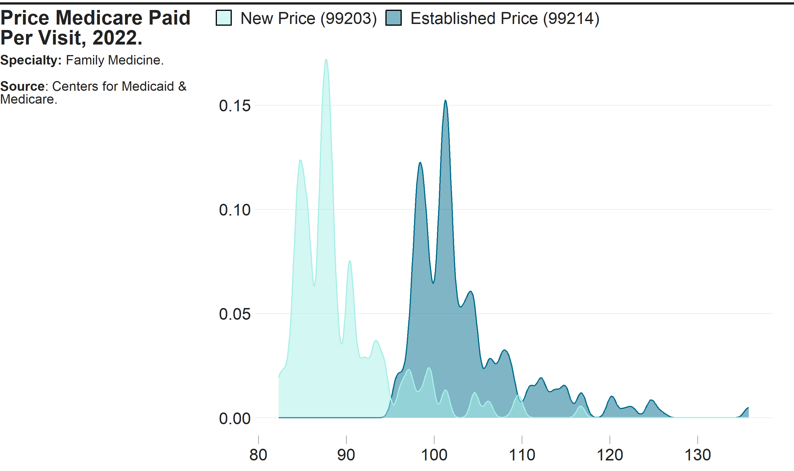

<!-- README.md is generated from README.Rmd. Please edit that file -->

# `costoffice` <a href="https://andrewallenbruce.github.io/costoffice/"></a>

<!-- badges: start -->

[](https://github.com/andrewallenbruce/costoffice/actions/workflows/R-CMD-check.yaml)
[](https://lifecycle.r-lib.org/articles/stages.html#experimental)
[](https://www.repostatus.org/#wip)
[](https://github.com/andrewallenbruce/costoffice)
[](https://github.com/andrewallenbruce/costoffice/commits/main)
[](https://www.codefactor.io/repository/github/andrewallenbruce/costoffice)
[](https://app.codecov.io/gh/andrewallenbruce/costoffice?branch=main)
<!-- badges: end -->

<br>

## Installation

You can install the development version of `costoffice` from
[GitHub](https://github.com/) with:

``` r
# install.packages("devtools")
devtools::install_github("andrewallenbruce/costoffice")
```

``` r
# install.packages("remotes")
remotes::install_github("andrewallenbruce/costoffice")
```

``` r
library(costoffice)
```

<br>

## Purpose

The `costoffice` package contains functions enabling the user to access
the latest **Physician Office Visit Costs** datasets from
[Data.CMS.gov](https://data.cms.gov/provider-data/search?page-size=50&theme=Physician%20office%20visit%20costs).

There are 83 datasets in total, the name corresponding to a medical
specialty(primary taxonomy). Each one contains:

- the most utilized procedure code (HCPCS Level II aka CPT code)
- the minimum, maximum, and mode price Medicare paid for the code and
- the minimum, maximum, and mode copay the patient paid for the visit

per zip code, for new and established patients both.

<br>

## `search_datasets()`

Call this function to return dataset information and the url to download
a csv file of the data.

<br>

Use the `specialty` argument to return only *exact* matches:

``` r
search_datasets(specialty = "cardiac surgery")
```

    #> # A tidytable: 1 × 6
    #>   specialty       title                 issued     modified   released   csv_url
    #>   <chr>           <chr>                 <date>     <date>     <date>     <chr>  
    #> 1 cardiac surgery Cardiac Surgery Offi… 2022-07-11 2022-07-11 2022-07-14 https:…

<br>

> Return a vector of the exact names of the medical specialties by
> simply calling `search_datasets()$specialty`.

<br>

Use the `keyword` argument to return *partial* matches:

``` r
search_datasets(keyword = "medicine")
```

    #> # A tidytable: 12 × 6
    #>    specialty                      title issued     modified   released   csv_url
    #>    <chr>                          <chr> <date>     <date>     <date>     <chr>  
    #>  1 addiction medicine             Addi… 2022-07-11 2022-07-11 2022-07-14 https:…
    #>  2 emergency medicine             Emer… 2022-07-11 2022-07-11 2022-07-14 https:…
    #>  3 geriatric medicine             Geri… 2022-07-11 2022-07-11 2022-07-14 https:…
    #>  4 internal medicine              Inte… 2022-07-11 2022-07-11 2022-07-14 https:…
    #>  5 nuclear medicine               Nucl… 2022-07-11 2022-07-11 2022-07-14 https:…
    #>  6 osteopathic manipulative medi… Oste… 2022-07-11 2022-07-11 2022-07-14 https:…
    #>  7 pediatric medicine             Pedi… 2022-07-11 2022-07-11 2022-07-14 https:…
    #>  8 physical medicine and rehabil… Phys… 2022-07-11 2022-07-11 2022-07-14 https:…
    #>  9 preventive medicine            Prev… 2022-07-11 2022-07-11 2022-07-14 https:…
    #> 10 sleep medicine                 Slee… 2022-07-11 2022-07-11 2022-07-14 https:…
    #> 11 sports medicine                Spor… 2022-07-11 2022-07-11 2022-07-14 https:…
    #> 12 undersea and hyperbaric medic… Unde… 2022-07-11 2022-07-11 2022-07-14 https:…

<br>

Calling the function with no arguments will return the entire dataset:

``` r
search_datasets()
```

    #> # A tidytable: 83 × 6
    #>    specialty                      title issued     modified   released   csv_url
    #>    <chr>                          <chr> <date>     <date>     <date>     <chr>  
    #>  1 addiction medicine             Addi… 2022-07-11 2022-07-11 2022-07-14 https:…
    #>  2 advanced heart failure and tr… Adva… 2022-07-11 2022-07-11 2022-07-14 https:…
    #>  3 allergy/ immunology            Alle… 2022-07-11 2022-07-11 2022-07-14 https:…
    #>  4 anesthesiology                 Anes… 2022-07-11 2022-07-11 2022-07-14 https:…
    #>  5 cardiac surgery                Card… 2022-07-11 2022-07-11 2022-07-14 https:…
    #>  6 cardiology                     Card… 2022-07-11 2022-07-11 2022-07-14 https:…
    #>  7 certified clinical nurse spec… Cert… 2022-07-11 2022-07-11 2022-07-14 https:…
    #>  8 certified nurse midwife        Cert… 2022-07-11 2022-07-11 2022-07-14 https:…
    #>  9 certified registered nurse an… Cert… 2022-07-11 2022-07-11 2022-07-14 https:…
    #> 10 clinic or group practice       Clin… 2022-07-11 2022-07-11 2022-07-14 https:…
    #> # ℹ 73 more rows

<br>

## `download_dataset()`

Once you’ve found the dataset that you’re interested in, simply insert
the `download_dataset()` function into your pipeline to retrieve the
csv:

``` r
search_datasets(specialty = "vascular surgery") |> 
  download_dataset() |> 
  head()
```

    #> # A tidytable: 6 × 16
    #>   specialty        zip_code new_code new_price_min new_price_max new_price_mode
    #>   <chr>            <chr>    <chr>            <dbl>         <dbl>          <dbl>
    #> 1 vascular surgery 00210    99203             60.1          182.           92.3
    #> 2 vascular surgery 00211    99203             60.1          182.           92.3
    #> 3 vascular surgery 00212    99203             60.1          182.           92.3
    #> 4 vascular surgery 00213    99203             60.1          182.           92.3
    #> 5 vascular surgery 00214    99203             60.1          182.           92.3
    #> 6 vascular surgery 00215    99203             60.1          182.           92.3
    #> # ℹ 10 more variables: new_copay_min <dbl>, new_copay_max <dbl>,
    #> #   new_copay_mode <dbl>, est_code <chr>, est_price_min <dbl>,
    #> #   est_price_max <dbl>, est_price_mode <dbl>, est_copay_min <dbl>,
    #> #   est_copay_max <dbl>, est_copay_mode <dbl>

<br>

## `use_zipcoder()`

``` r
search_datasets(specialty = "vascular surgery") |> 
  download_dataset() |> 
  tidytable::slice_sample(n = 10) |> 
  use_zipcoder()
```

    #> # A tidytable: 10 × 28
    #>    city     county state zip_code specialty new_code new_price_min new_price_max
    #>    <chr>    <chr>  <chr> <chr>    <chr>     <chr>            <dbl>         <dbl>
    #>  1 Fort La… Browa… FL    33329    vascular… 99203             61.4          187.
    #>  2 La Honda San M… CA    94020    vascular… 99203             69.9          206.
    #>  3 New York New Y… NY    10179    vascular… 99203             69.5          209.
    #>  4 Sherwood Frank… TN    37376    vascular… 99203             54.6          167.
    #>  5 Jones M… Westm… PA    15646    vascular… 99203             57.0          174.
    #>  6 Yale     Guthr… IA    50277    vascular… 99203             54.9          168.
    #>  7 Baptist… Hunte… NJ    08803    vascular… 99203             66.5          198.
    #>  8 Hampton… Rocki… NH    03844    vascular… 99203             60.1          182.
    #>  9 Black C… Outag… WI    54106    vascular… 99203             55.6          169.
    #> 10 Fort Be… Chatt… GA    31905    vascular… 99203             55.2          170.
    #> # ℹ 20 more variables: new_price_mode <dbl>, new_copay_min <dbl>,
    #> #   new_copay_max <dbl>, new_copay_mode <dbl>, est_code <chr>,
    #> #   est_price_min <dbl>, est_price_max <dbl>, est_price_mode <dbl>,
    #> #   est_copay_min <dbl>, est_copay_max <dbl>, est_copay_mode <dbl>, lat <dbl>,
    #> #   lng <dbl>, bounds_west <dbl>, bounds_east <dbl>, bounds_north <dbl>,
    #> #   bounds_south <dbl>, demographics <list>, is_zcta <lgl>,
    #> #   zcta_crosswalk <list>

<br>

## `download_datasets()`

``` r
download_datasets(keyword = "medicine")
```

    #> # A tidytable: 397,248 × 28
    #>    specialty    city  county state zip_code new_code new_price_min new_price_max
    #>    <chr>        <chr> <chr>  <chr> <chr>    <chr>            <dbl>         <dbl>
    #>  1 Addiction_M… Agua… Aguad… PR    00602    99204             59.4          180.
    #>  2 Addiction_M… Agua… Aguad… PR    00603    99204             59.4          180.
    #>  3 Addiction_M… Mari… Maric… PR    00606    99204             59.4          180.
    #>  4 Addiction_M… Anas… Aasco… PR    00610    99204             59.4          180.
    #>  5 Addiction_M… Arec… Areci… PR    00612    99204             59.4          180.
    #>  6 Addiction_M… Baja… Areci… PR    00616    99204             59.4          180.
    #>  7 Addiction_M… Barc… Barce… PR    00617    99204             59.4          180.
    #>  8 Addiction_M… Boqu… Cabo … PR    00622    99204             59.4          180.
    #>  9 Addiction_M… Cabo… Cabo … PR    00623    99204             59.4          180.
    #> 10 Addiction_M… Camuy Camuy… PR    00627    99204             59.4          180.
    #> # ℹ 397,238 more rows
    #> # ℹ 20 more variables: new_price_mode <dbl>, new_copay_min <dbl>,
    #> #   new_copay_max <dbl>, new_copay_mode <dbl>, est_code <chr>,
    #> #   est_price_min <dbl>, est_price_max <dbl>, est_price_mode <dbl>,
    #> #   est_copay_min <dbl>, est_copay_max <dbl>, est_copay_mode <dbl>, lat <dbl>,
    #> #   lng <dbl>, bounds_west <dbl>, bounds_east <dbl>, bounds_north <dbl>,
    #> #   bounds_south <dbl>, demographics <list>, is_zcta <lgl>, …

<br>

## Summary Statistics by State

Current average prices by state for a **New Patient** office visit to a
**Vascular Surgeon**:

``` r
search_datasets(specialty = "vascular surgery") |> 
  download_dataset() |> 
  use_zipcoder() |> 
  tidytable::select(specialty, 
                    state, 
                    tidytable::starts_with("new_")) |> 
  tidytable::summarise(avg_price_mode = round(mean(new_price_mode), 2),
                       avg_copay_mode = round(mean(new_copay_mode), 2),
                       .by = c(specialty, 
                               state, 
                               new_code)) |> 
  tidytable::drop_na() |> 
  knitr::kable()
```

| specialty        | state | new_code | avg_price_mode | avg_copay_mode |
|:-----------------|:------|:---------|---------------:|---------------:|
| vascular surgery | AK    | 99203    |         116.69 |          29.17 |
| vascular surgery | AL    | 99203    |          85.95 |          21.49 |
| vascular surgery | AR    | 99203    |          82.31 |          20.58 |
| vascular surgery | AZ    | 99203    |          88.34 |          22.08 |
| vascular surgery | CA    | 99203    |          97.69 |          24.42 |
| vascular surgery | CO    | 99203    |          92.05 |          23.01 |
| vascular surgery | CT    | 99203    |          97.18 |          24.30 |
| vascular surgery | DC    | 99203    |         104.59 |          26.15 |
| vascular surgery | DE    | 99203    |          91.85 |          22.96 |
| vascular surgery | FL    | 99203    |          91.92 |          22.98 |
| vascular surgery | GA    | 99203    |          86.83 |          21.71 |
| vascular surgery | HI    | 99203    |          96.11 |          24.03 |
| vascular surgery | IA    | 99203    |          84.67 |          21.17 |
| vascular surgery | ID    | 99203    |          83.37 |          20.84 |
| vascular surgery | IL    | 99203    |          90.37 |          22.59 |
| vascular surgery | IN    | 99203    |          84.54 |          21.14 |
| vascular surgery | KS    | 99203    |          84.86 |          21.21 |
| vascular surgery | KY    | 99203    |          84.75 |          21.19 |
| vascular surgery | LA    | 99203    |          87.37 |          21.84 |
| vascular surgery | MA    | 99203    |          96.24 |          24.06 |
| vascular surgery | MD    | 99203    |          97.23 |          24.31 |
| vascular surgery | ME    | 99203    |          86.06 |          21.51 |
| vascular surgery | MI    | 99203    |          88.46 |          22.12 |
| vascular surgery | MN    | 99203    |          88.84 |          22.21 |
| vascular surgery | MO    | 99203    |          85.12 |          21.28 |
| vascular surgery | MS    | 99203    |          82.96 |          20.74 |
| vascular surgery | MT    | 99203    |          90.90 |          22.73 |
| vascular surgery | NC    | 99203    |          87.21 |          21.80 |
| vascular surgery | ND    | 99203    |          88.62 |          22.15 |
| vascular surgery | NE    | 99203    |          83.92 |          20.98 |
| vascular surgery | NH    | 99203    |          92.26 |          23.06 |
| vascular surgery | NJ    | 99203    |         100.13 |          25.03 |
| vascular surgery | NM    | 99203    |          87.31 |          21.83 |
| vascular surgery | NV    | 99203    |          92.70 |          23.17 |
| vascular surgery | NY    | 99203    |          96.01 |          24.00 |
| vascular surgery | OH    | 99203    |          87.73 |          21.93 |
| vascular surgery | OK    | 99203    |          85.07 |          21.27 |
| vascular surgery | OR    | 99203    |          88.22 |          22.06 |
| vascular surgery | PA    | 99203    |          89.32 |          22.33 |
| vascular surgery | PR    | 99203    |          91.28 |          22.82 |
| vascular surgery | RI    | 99203    |          93.88 |          23.47 |
| vascular surgery | SC    | 99203    |          85.63 |          21.41 |
| vascular surgery | SD    | 99203    |          88.26 |          22.07 |
| vascular surgery | TN    | 99203    |          84.32 |          21.08 |
| vascular surgery | TX    | 99203    |          88.43 |          22.11 |
| vascular surgery | UT    | 99203    |          86.74 |          21.69 |
| vascular surgery | VA    | 99203    |          91.87 |          22.97 |
| vascular surgery | VT    | 99203    |          89.24 |          22.31 |
| vascular surgery | WA    | 99203    |          92.12 |          23.03 |
| vascular surgery | WI    | 99203    |          85.61 |          21.40 |
| vascular surgery | WV    | 99203    |          85.85 |          21.46 |
| vascular surgery | WY    | 99203    |          90.34 |          22.58 |

<br>

Current average prices by state for an **Established Patient** office
visit to a **Cardiologist**:

``` r
est_cardio <- search_datasets(specialty = "cardiology") |> 
  download_dataset() |> 
  use_zipcoder() |> 
  tidytable::select(specialty, 
                    state, 
                    tidytable::starts_with("est_")) |> 
  tidytable::summarise(
    avg_price_min = round(mean(est_price_min), 2),
    avg_price_mode = round(mean(est_price_mode), 2),
    avg_price_max = round(mean(est_price_max), 2),
    avg_copay_min = round(mean(est_copay_min), 2),
    avg_copay_mode = round(mean(est_copay_mode), 2),
    avg_copay_max = round(mean(est_copay_min), 2),
                       .by = c(specialty, 
                               state, 
                               est_code)) |> 
  tidytable::drop_na()

est_cardio |> knitr::kable()
```

| specialty  | state | est_code | avg_price_min | avg_price_mode | avg_price_max | avg_copay_min | avg_copay_mode | avg_copay_max |
|:-----------|:------|:---------|--------------:|---------------:|--------------:|--------------:|---------------:|--------------:|
| cardiology | AK    | 99214    |         22.38 |         135.85 |        190.74 |          5.59 |          33.96 |          5.59 |
| cardiology | AL    | 99214    |         16.94 |          99.34 |        139.09 |          4.23 |          24.83 |          4.23 |
| cardiology | AR    | 99214    |         16.26 |          95.61 |        133.85 |          4.07 |          23.90 |          4.07 |
| cardiology | AZ    | 99214    |         17.74 |         102.07 |        142.65 |          4.44 |          25.52 |          4.44 |
| cardiology | CA    | 99214    |         20.49 |         112.92 |        157.12 |          5.12 |          28.23 |          5.12 |
| cardiology | CO    | 99214    |         18.98 |         106.33 |        148.20 |          4.75 |          26.58 |          4.75 |
| cardiology | CT    | 99214    |         20.09 |         112.10 |        156.18 |          5.02 |          28.02 |          5.02 |
| cardiology | DC    | 99214    |         21.87 |         120.20 |        167.25 |          5.47 |          30.05 |          5.47 |
| cardiology | DE    | 99214    |         18.72 |         105.98 |        147.89 |          4.68 |          26.50 |          4.68 |
| cardiology | FL    | 99214    |         18.06 |         105.48 |        147.69 |          4.52 |          26.37 |          4.52 |
| cardiology | GA    | 99214    |         17.23 |         100.34 |        140.40 |          4.31 |          25.08 |          4.31 |
| cardiology | HI    | 99214    |         20.26 |         111.01 |        154.37 |          5.06 |          27.75 |          5.06 |
| cardiology | IA    | 99214    |         17.04 |          98.30 |        137.37 |          4.26 |          24.57 |          4.26 |
| cardiology | ID    | 99214    |         16.65 |          96.84 |        135.44 |          4.16 |          24.21 |          4.16 |
| cardiology | IL    | 99214    |         17.84 |         103.97 |        145.52 |          4.46 |          25.99 |          4.46 |
| cardiology | IN    | 99214    |         16.96 |          98.12 |        137.16 |          4.24 |          24.53 |          4.24 |
| cardiology | KS    | 99214    |         17.06 |          98.47 |        137.62 |          4.27 |          24.62 |          4.27 |
| cardiology | KY    | 99214    |         16.66 |          98.06 |        137.34 |          4.16 |          24.52 |          4.16 |
| cardiology | LA    | 99214    |         16.95 |         100.61 |        141.05 |          4.24 |          25.15 |          4.24 |
| cardiology | MA    | 99214    |         19.92 |         111.09 |        154.77 |          4.98 |          27.77 |          4.98 |
| cardiology | MD    | 99214    |         19.93 |         111.90 |        156.04 |          4.98 |          27.98 |          4.98 |
| cardiology | ME    | 99214    |         17.24 |          99.67 |        139.34 |          4.31 |          24.92 |          4.31 |
| cardiology | MI    | 99214    |         17.52 |         102.01 |        142.75 |          4.38 |          25.50 |          4.38 |
| cardiology | MN    | 99214    |         18.42 |         103.05 |        143.57 |          4.60 |          25.76 |          4.60 |
| cardiology | MO    | 99214    |         16.76 |          98.47 |        137.89 |          4.19 |          24.62 |          4.19 |
| cardiology | MS    | 99214    |         16.26 |          96.18 |        134.74 |          4.06 |          24.04 |          4.06 |
| cardiology | MT    | 99214    |         18.42 |         104.87 |        146.42 |          4.60 |          26.22 |          4.60 |
| cardiology | NC    | 99214    |         17.43 |         100.83 |        140.98 |          4.36 |          25.21 |          4.36 |
| cardiology | ND    | 99214    |         18.26 |         102.74 |        143.22 |          4.57 |          25.68 |          4.57 |
| cardiology | NE    | 99214    |         17.00 |          97.60 |        136.31 |          4.25 |          24.40 |          4.25 |
| cardiology | NH    | 99214    |         18.90 |         106.44 |        148.44 |          4.72 |          26.61 |          4.72 |
| cardiology | NJ    | 99214    |         20.92 |         115.41 |        160.62 |          5.23 |          28.85 |          5.23 |
| cardiology | NM    | 99214    |         17.10 |         100.67 |        141.02 |          4.28 |          25.17 |          4.28 |
| cardiology | NV    | 99214    |         18.54 |         106.60 |        149.00 |          4.64 |          26.65 |          4.64 |
| cardiology | NY    | 99214    |         19.38 |         110.32 |        154.05 |          4.84 |          27.58 |          4.84 |
| cardiology | OH    | 99214    |         17.31 |         101.20 |        141.66 |          4.33 |          25.30 |          4.33 |
| cardiology | OK    | 99214    |         16.80 |          98.46 |        137.83 |          4.20 |          24.61 |          4.20 |
| cardiology | OR    | 99214    |         17.99 |         102.22 |        142.65 |          4.50 |          25.55 |          4.50 |
| cardiology | PA    | 99214    |         17.93 |         103.13 |        144.12 |          4.48 |          25.78 |          4.48 |
| cardiology | PR    | 99214    |         18.53 |         105.28 |        146.97 |          4.63 |          26.32 |          4.63 |
| cardiology | RI    | 99214    |         19.15 |         108.29 |        151.08 |          4.79 |          27.07 |          4.79 |
| cardiology | SC    | 99214    |         17.06 |          99.16 |        138.70 |          4.27 |          24.79 |          4.27 |
| cardiology | SD    | 99214    |         18.24 |         102.41 |        142.72 |          4.56 |          25.60 |          4.56 |
| cardiology | TN    | 99214    |         16.86 |          97.85 |        136.82 |          4.22 |          24.46 |          4.22 |
| cardiology | TX    | 99214    |         17.98 |         102.41 |        142.95 |          4.50 |          25.60 |          4.50 |
| cardiology | UT    | 99214    |         17.30 |         100.33 |        140.30 |          4.33 |          25.08 |          4.33 |
| cardiology | VA    | 99214    |         18.70 |         106.01 |        147.93 |          4.68 |          26.50 |          4.68 |
| cardiology | VT    | 99214    |         18.32 |         103.32 |        144.09 |          4.58 |          25.83 |          4.58 |
| cardiology | WA    | 99214    |         18.97 |         106.44 |        148.38 |          4.74 |          26.61 |          4.74 |
| cardiology | WI    | 99214    |         17.46 |          99.46 |        138.80 |          4.37 |          24.86 |          4.37 |
| cardiology | WV    | 99214    |         16.62 |          98.99 |        138.83 |          4.15 |          24.75 |          4.15 |
| cardiology | WY    | 99214    |         18.38 |         104.34 |        145.62 |          4.59 |          26.08 |          4.59 |

<br>

## Visualizations

``` r
p1 <- ggplot2::ggplot(est_cardio, 
        ggplot2::aes(
          forcats::fct_reorder(state, 
                               avg_price_mode, 
                               median),
                               avg_price_mode)) + 
  ggplot2::geom_pointrange(
    ggplot2::aes(ymin = avg_price_min, 
                 ymax = avg_price_max), 
    size = 0, 
    colour = "black", 
    linewidth = 0.5) +
  ggplot2::geom_point(color = "black", size = 3) +
  #ggplot2::geom_point(shape = "circle open", size = 5, color = "red") +
  ggplot2::coord_flip() +
  ggplot2::scale_y_continuous(labels = scales::label_dollar()) +
  ggplot2::labs(
    x = "", 
    y = "Minimum, Mode, Maximum",
    title = "",
    subtitle = "Price Ranges by State") +
  ggplot2::theme_minimal()

p2 <- ggplot2::ggplot(est_cardio, ggplot2::aes(forcats::fct_reorder(state, 
                                          avg_copay_mode, 
                                          median),
                                          avg_copay_mode)) + 
  ggplot2::geom_pointrange(ggplot2::aes(ymin = avg_copay_min, 
                 ymax = avg_copay_mode)) +
  ggplot2::coord_flip() +
  ggplot2::scale_y_continuous(labels = scales::label_dollar()) +
  ggplot2::labs(
    x = "", 
    y = "Average Minimum to Mode",
    title = "",
    subtitle = "Copay Ranges by State") +
  ggplot2::theme_minimal()

library(patchwork)
(p1 + p2) +
  plot_annotation(
    title = "Cardiology: Established Patient Office Visit Costs",
    caption = "Source: data.cms.gov/provider-data",
    theme = ggplot2::theme(plot.title = ggplot2::element_text(size = 16))
  )
```


<br>

``` r
library(statebins)

statebins(est_cardio, 
          value_col = "avg_copay_mode",
          name = "Average Medicare Copays",
          ggplot2_scale_function = viridis::scale_fill_viridis,
          direction = 1,
          round = FALSE) +
  ggplot2::labs(title = "Established Patient Office Visit Costs: Cardiology") +
  theme_statebins()
```



<br>

## Code of Conduct

Please note that the `costoffice` project is released with a
[Contributor Code of
Conduct](https://andrewallenbruce.github.io/costoffice/CODE_OF_CONDUCT.html).
By contributing to this project, you agree to abide by its terms.
